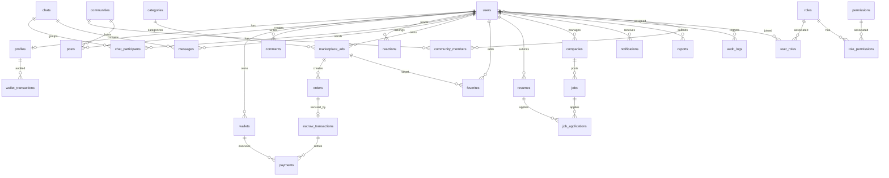

# EQUHUB — Единая цифровая платформа

## Документ 1: Полная ER-диаграмма базы данных (ERD)

### 1. Архитектура слоя данных

База данных EQUHUB спроектирована на СУБД **PostgreSQL 15+** для обеспечения транзакционности (ACID), ссылочной целостности и гибкого индексирования. Для кэширования сессий, профилей и очередей используется **Redis 7**, а для медиафайлов — **MinIO S3**.

---

### 2. ER-диаграмма в формате Mermaid

Ниже представлена полная концептуальная и логическая схема базы данных.

---

### 3. Детальное описание сущностей и полей

#### 3.1. Users (Пользователи)
Таблица учетных записей для авторизации и идентификации.
*   `id` (UUID, PK): Уникальный идентификатор пользователя.
*   `email` (VARCHAR(255), UNIQUE): Адрес электронной почты.
*   `password_hash` (VARCHAR(255)): Хэш пароля (Passlib/Bcrypt).
*   `is_two_factor_enabled` (BOOLEAN): Статус двухфакторной аутентификации.
*   `totp_secret` (VARCHAR(128), NULL): Секретный ключ для TOTP.
*   `created_at` (TIMESTAMP): Дата и время регистрации.
*   `updated_at` (TIMESTAMP): Дата и время последнего обновления.

#### 3.2. Profiles (Профили)
Детальная информация о пользователе.
*   `id` (UUID, PK, FK -> users.id): Связь один-к-одному с учетной записью.
*   `name` (VARCHAR(100)): Имя и фамилия.
*   `avatar_url` (VARCHAR(512), NULL): Ссылка на аватар в MinIO S3.
*   `cover_url` (VARCHAR(512), NULL): Ссылка на обложку профиля.
*   `bio` (TEXT, NULL): Биографические данные.
*   `city` (VARCHAR(100), NULL): Город проживания.
*   `seller_rating` (DECIMAL(3, 2), DEFAULT 5.0): Рейтинг продавца.
*   `privacy_settings` (JSONB): Настройки приватности отображения данных.

#### 3.3. Posts (Публикации)
Сообщения и статьи в социальной сети.
*   `id` (UUID, PK): Уникальный идентификатор публикации.
*   `author_id` (UUID, FK -> users.id): Автор публикации.
*   `community_id` (UUID, FK -> communities.id, NULL): Идентификатор сообщества (если опубликовано в группе).
*   `content` (TEXT): Текстовое содержимое поста.
*   `media_urls` (TEXT[]): Массив ссылок на прикрепленные медиафайлы.
*   `created_at` (TIMESTAMP): Время публикации.

#### 3.4. Comments (Комментарии)
*   `id` (UUID, PK): Идентификатор комментария.
*   `post_id` (UUID, FK -> posts.id): К какому посту относится.
*   `author_id` (UUID, FK -> users.id): Автор комментария.
*   `content` (TEXT): Текст комментария.
*   `created_at` (TIMESTAMP).

#### 3.5. Reactions (Реакции)
*   `id` (UUID, PK): Идентификатор реакции.
*   `user_id` (UUID, FK -> users.id): Кто поставил реакцию.
*   `post_id` (UUID, FK -> posts.id, NULL).
*   `comment_id` (UUID, FK -> comments.id, NULL).
*   `type` (VARCHAR(20)): Тип реакции (like, love, laugh, etc.).

#### 3.6. Chats (Чаты)
Группы или диалоги для обмена сообщениями.
*   `id` (UUID, PK): Идентификатор чата.
*   `type` (VARCHAR(20)): Тип чата (direct, group, channel).
*   `title` (VARCHAR(150), NULL): Название (для групповых чатов).
*   `created_at` (TIMESTAMP).

#### 3.7. Messages (Сообщения)
*   `id` (UUID, PK): Идентификатор сообщения.
*   `chat_id` (UUID, FK -> chats.id): Чат доставки.
*   `sender_id` (UUID, FK -> users.id): Отправитель.
*   `text` (TEXT, NULL): Текстовое содержимое.
*   `file_url` (VARCHAR(512), NULL): Ссылка на прикрепленный файл.
*   `is_read` (BOOLEAN, DEFAULT FALSE): Флаг прочтения.
*   `created_at` (TIMESTAMP).

#### 3.8. Communities (Сообщества)
Группы по интересам.
*   `id` (UUID, PK): Идентификатор сообщества.
*   `name` (VARCHAR(150)): Название группы.
*   `description` (TEXT): Описание группы.
*   `avatar_url` (VARCHAR(512), NULL).
*   `created_by` (UUID, FK -> users.id): Создатель сообщества.

#### 3.9. MarketplaceAds (Объявления Маркетплейса)
*   `id` (UUID, PK): Идентификатор объявления.
*   `seller_id` (UUID, FK -> users.id): Продавец.
*   `category_id` (UUID, FK -> categories.id): Категория товара/услуги.
*   `title` (VARCHAR(200)): Название товара.
*   `description` (TEXT): Описание.
*   `price` (DECIMAL(12, 2)): Стоимость товара в рублях.
*   `city` (VARCHAR(100)): Город продажи.
*   `image_url` (VARCHAR(512)): Ссылка на основное изображение.
*   `ai_score` (INTEGER, DEFAULT 100): Оценка качества контента от AI-ассистента.
*   `status` (VARCHAR(20)): Статус объявления (active, sold, moderated).
*   `created_at` (TIMESTAMP).

#### 3.10. EscrowTransactions (Безопасные Сделки)
Логика блокировки и удержания средств по транзакциям.
*   `id` (UUID, PK): Идентификатор транзакции Escrow.
*   `order_id` (UUID, FK -> orders.id): Заказ на маркетплейсе.
*   `buyer_id` (UUID, FK -> users.id): Покупатель.
*   `seller_id` (UUID, FK -> users.id): Продавец.
*   `amount` (DECIMAL(12, 2)): Заблокированная сумма сделки.
*   `status` (VARCHAR(20)): Текущее состояние сделки (created, active/hold, shipped, completed, dispute).
*   `step` (INTEGER): Текущий шаг сделки (1: Создана, 2: Оплачена, 3: Отправлена, 4: Завершена).
*   `created_at` (TIMESTAMP).

#### 3.11. Wallets (Кошельки)
Балансы пользователей внутри EQUHUB.
*   `id` (UUID, PK): Идентификатор кошелька.
*   `user_id` (UUID, UNIQUE, FK -> users.id): Владелец кошелька.
*   `balance` (DECIMAL(12, 2), DEFAULT 0.00): Текущий рублевый баланс.
*   `updated_at` (TIMESTAMP).

---

### 4. Рекомендуемые индексы и оптимизация производительности

Для обеспечения сверхнизкой задержки транзакций и поисковых запросов внедряются следующие типы индексов в PostgreSQL:
1.  **Полнотекстовый поиск:** `CREATE INDEX idx_marketplace_ads_title_desc_gin ON marketplace_ads USING gin(to_tsvector('russian', title || ' ' || description));`
2.  **Гео-поиск:** `CREATE INDEX idx_marketplace_ads_geo ON marketplace_ads USING gist(geo_location);` (при интеграции с расширением PostGIS).
3.  **Индекс по составным фильтрам категории и цены:** `CREATE INDEX idx_ads_category_price ON marketplace_ads(category_id, price) WHERE status = 'active';`
4.  **Сортировка логов чатов по дате:** `CREATE INDEX idx_messages_chat_created ON messages(chat_id, created_at DESC);`
