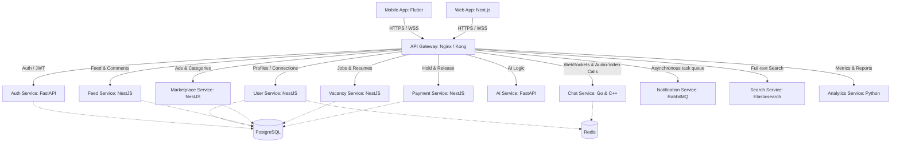
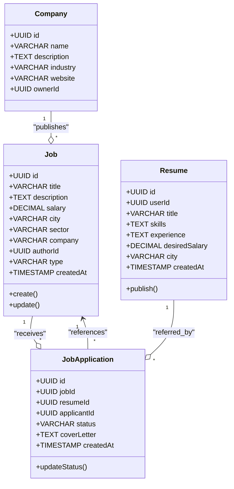

# EQUHUB — Единая цифровая платформа

## Документ 2: UML-диаграммы модулей и сервисов

### 1. Системная архитектура (UML Deployment & Component Diagram)

Платформа EQUHUB построена на микросервисной архитектуре. Взаимодействие между клиентами и бэкенд-сервисами осуществляется через API Gateway, который решает задачи маршрутизации, аутентификации JWT и rate limiting.



---

### 2. Сценарий покупки на маркетплейсе через Escrow (UML Sequence Diagram)

Ниже представлена детальная последовательность шагов при совершении безопасной сделки на маркетплейсе EQUHUB:

```mermaid
sequence_diagram
    autonumber
    actor Buyer as Покупатель (Екатерина)
    participant Gateway as API Gateway
    participant Market as Market Service
    participant Pay as Payment Service
    participant Chat as Chat Service
    participant Seller as Продавец (Илья)

    Buyer->>Gateway: Создать заказ на MacBook (POST /ads/order)
    Gateway->>Market: Валидация объявления l1
    Market-->>Gateway: Валидно. Цена: 320,000 ₽
    Gateway->>Pay: Инициализировать Escrow сделку e1
    Pay->>Pay: Заблокировать (холд) 320,000 ₽ на балансе Покупателя
    Pay-->>Gateway: Средства успешно заморожены. Статус: "ОПЛАЧЕНА"
    Gateway->>Chat: Отправить системное сообщение в WebSocket
    Chat-->>Seller: Входящее push-уведомление: "Товар оплачен. Подготовьте отправку!"

    Note over Seller, Buyer: Продавец отправляет товар курьером
    Seller->>Gateway: Товар передан курьеру (POST /escrow/ship)
    Gateway->>Pay: Обновить статус сделки: "ОТПРАВЛЕНА" (Шаг 3)
    Pay-->>Buyer: WebSocket push: "Товар в пути"

    Note over Buyer: Покупатель осматривает товар при получении
    Buyer->>Gateway: Подтвердить получение товара (POST /escrow/confirm)
    Gateway->>Pay: Разблокировать средства (release)
    Pay->>Pay: Списать 320,000 ₽ со счета Escrow
    Pay->>Pay: Начислить +320,000 ₽ на кошелек Продавца (Илья)
    Pay-->>Gateway: Транзакция e1 завершена успешно
    Gateway-->>Buyer: Уведомление: Сделка закрыта 🎉
```

---

### 3. Диаграмма классов (UML Class Diagram) для Вакансий и Резюме (Vacancy Service)

Раздел **«Работа»** оперирует сущностями Вакансий, Резюме и Откликов. Классы структурированы следующим образом:


