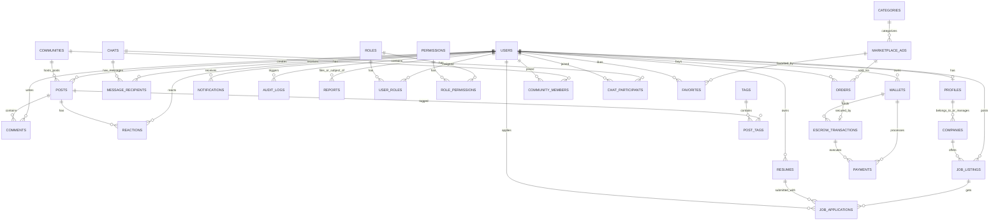

# 1. Полная ER-диаграмма базы данных (EQUHUB)

Данный документ представляет детальную Entity-Relationship (ER) диаграмму и описание структуры таблиц базы данных для Единой цифровой платформы **EQUHUB**.

База данных построена на СУБД **PostgreSQL 15+** с поддержкой расширения `pg_trgm` для текстового поиска и `postgis` для поиска по геокоординатам.

## 1.1 Диаграмма сущностей (Mermaid ER-Diagram)



---

## 1.2 Описание таблиц и атрибутов

### 1.2.1 Users (Пользователи)
Основная системная таблица учетных записей.

| Название поля | Тип данных | Ограничения | Описание |
| :--- | :--- | :--- | :--- |
| `id` | UUID | PRIMARY KEY, DEFAULT gen_random_uuid() | Уникальный идентификатор |
| `email` | VARCHAR(255) | UNIQUE, NOT NULL | Электронная почта (логин) |
| `password_hash` | VARCHAR(255) | NOT NULL | Хэш пароля (bcrypt/argon2) |
| `phone` | VARCHAR(20) | UNIQUE | Номер телефона |
| `is_active` | BOOLEAN | DEFAULT TRUE | Статус активности аккаунта |
| `is_verified` | BOOLEAN | DEFAULT FALSE | Подтвержден ли аккаунт |
| `two_factor_secret` | VARCHAR(128)| NULL | Секрет TOTP для 2FA |
| `two_factor_enabled`| BOOLEAN | DEFAULT FALSE | Включена ли 2FA |
| `created_at` | TIMESTAMPTZ | DEFAULT NOW() | Дата регистрации |
| `updated_at` | TIMESTAMPTZ | DEFAULT NOW() | Дата обновления |

### 1.2.2 Profiles (Профили пользователей)
Публичные и личные данные пользователя.

| Название поля | Тип данных | Ограничения | Описание |
| :--- | :--- | :--- | :--- |
| `user_id` | UUID | PRIMARY KEY, FOREIGN KEY REFERENCES Users(id) | Идентификатор пользователя |
| `first_name` | VARCHAR(100) | NOT NULL | Имя |
| `last_name` | VARCHAR(100) | NOT NULL | Фамилия |
| `avatar_url` | VARCHAR(512) | | Ссылка на аватар в S3 (MinIO) |
| `cover_url` | VARCHAR(512) | | Ссылка на фоновое изображение профиля |
| `bio` | TEXT | | Краткая биография |
| `city` | VARCHAR(100) | | Город проживания |
| `contacts` | JSONB | | Дополнительные контакты (Telegram, VK, etc) |
| `interests` | VARCHAR(100)[] | | Массив интересов/тэгов |
| `rating` | NUMERIC(3,2) | DEFAULT 5.0 | Рейтинг на платформе |
| `achievements` | JSONB | | Достижения и награды пользователя |
| `privacy_settings`| JSONB | | Настройки приватности профиля |

### 1.2.3 Posts (Публикации в социальной сети)
Посты пользователей или сообществ.

| Название поля | Тип данных | Ограничения | Описание |
| :--- | :--- | :--- | :--- |
| `id` | UUID | PRIMARY KEY | Идентификатор публикации |
| `author_id` | UUID | FOREIGN KEY REFERENCES Users(id), NOT NULL | Автор публикации |
| `community_id` | UUID | FOREIGN KEY REFERENCES Communities(id) | Сообщество (если пост в группе) |
| `content` | TEXT | NOT NULL | Текстовое содержимое |
| `media_urls` | VARCHAR(512)[] | | Массив ссылок на изображения/видео в MinIO |
| `likes_count` | INT | DEFAULT 0 | Счетчик лайков |
| `comments_count`| INT | DEFAULT 0 | Счетчик комментариев |
| `created_at` | TIMESTAMPTZ | DEFAULT NOW() | Дата публикации |

### 1.2.4 Comments (Комментарии к публикациям)
| Название поля | Тип данных | Ограничения | Описание |
| :--- | :--- | :--- | :--- |
| `id` | UUID | PRIMARY KEY | Идентификатор комментария |
| `post_id` | UUID | FOREIGN KEY REFERENCES Posts(id), ON DELETE CASCADE | Публикация |
| `author_id` | UUID | FOREIGN KEY REFERENCES Users(id) | Автор |
| `content` | TEXT | NOT NULL | Текст комментария |
| `parent_id` | UUID | FOREIGN KEY REFERENCES Comments(id) | Родительский комментарий (для тредов) |
| `created_at` | TIMESTAMPTZ | DEFAULT NOW() | Дата |

### 1.2.5 Reactions (Реакции на посты и комментарии)
| Название поля | Тип данных | Ограничения | Описание |
| :--- | :--- | :--- | :--- |
| `id` | UUID | PRIMARY KEY | Идентификатор реакции |
| `user_id` | UUID | FOREIGN KEY REFERENCES Users(id), NOT NULL | Пользователь |
| `target_type` | VARCHAR(50) | NOT NULL (CHECK: 'post', 'comment') | Тип объекта реакции |
| `target_id` | UUID | NOT NULL | ID объекта |
| `reaction_type`| VARCHAR(20) | NOT NULL (like, love, haha, sad, angry) | Тип эмодзи |
| `created_at` | TIMESTAMPTZ | DEFAULT NOW() | Дата |

### 1.2.6 Chats (Чаты / Групповые чаты)
| Название поля | Тип данных | Ограничения | Описание |
| :--- | :--- | :--- | :--- |
| `id` | UUID | PRIMARY KEY | Идентификатор чата |
| `title` | VARCHAR(255) | | Название чата (для групповых) |
| `is_group` | BOOLEAN | DEFAULT FALSE | Флаг группового чата |
| `created_by` | UUID | FOREIGN KEY REFERENCES Users(id) | Создатель |
| `created_at` | TIMESTAMPTZ | DEFAULT NOW() | Дата создания |

### 1.2.7 ChatParticipants (Участники чатов)
| Название поля | Тип данных | Ограничения | Описание |
| :--- | :--- | :--- | :--- |
| `chat_id` | UUID | FOREIGN KEY REFERENCES Chats(id), ON DELETE CASCADE | Чат |
| `user_id` | UUID | FOREIGN KEY REFERENCES Users(id), ON DELETE CASCADE | Пользователь |
| `joined_at` | TIMESTAMPTZ | DEFAULT NOW() | Дата вступления |
| PRIMARY KEY | (chat_id, user_id) | | Составной ключ |

### 1.2.8 Messages (Сообщения в мессенджере)
| Название поля | Тип данных | Ограничения | Описание |
| :--- | :--- | :--- | :--- |
| `id` | UUID | PRIMARY KEY | Идентификатор сообщения |
| `chat_id` | UUID | FOREIGN KEY REFERENCES Chats(id) | Чат |
| `sender_id` | UUID | FOREIGN KEY REFERENCES Users(id) | Отправитель |
| `content` | TEXT | NOT NULL | Содержимое сообщения |
| `file_urls` | VARCHAR(512)[] | | Ссылки на прикрепленные файлы |
| `is_encrypted` | BOOLEAN | DEFAULT FALSE | Зашифровано ли сквозным шифрованием |
| `is_read` | BOOLEAN | DEFAULT FALSE | Статус прочтения |
| `expires_at` | TIMESTAMPTZ | NULL | Время удаления (для исчезающих сообщений) |
| `created_at` | TIMESTAMPTZ | DEFAULT NOW() | Время отправки |

### 1.2.9 Communities (Группы / Сообщества)
| Название поля | Тип данных | Ограничения | Описание |
| :--- | :--- | :--- | :--- |
| `id` | UUID | PRIMARY KEY | Идентификатор сообщества |
| `name` | VARCHAR(255) | UNIQUE, NOT NULL | Название |
| `description` | TEXT | | Описание сообщества |
| `avatar_url` | VARCHAR(512) | | Обложка сообщества |
| `creator_id` | UUID | FOREIGN KEY REFERENCES Users(id) | Создатель |
| `is_private` | BOOLEAN | DEFAULT FALSE | Закрытое ли сообщество |
| `created_at` | TIMESTAMPTZ | DEFAULT NOW() | Дата создания |

### 1.2.10 MarketplaceAds (Объявления Маркетплейса)
Сущность для товаров, услуг, автомобилей и недвижимости.

| Название поля | Тип данных | Ограничения | Описание |
| :--- | :--- | :--- | :--- |
| `id` | UUID | PRIMARY KEY | Идентификатор объявления |
| `seller_id` | UUID | FOREIGN KEY REFERENCES Users(id), NOT NULL | Продавец |
| `category_id` | UUID | FOREIGN KEY REFERENCES Categories(id), NOT NULL | Ссылка на категорию |
| `title` | VARCHAR(255) | NOT NULL | Заголовок |
| `description` | TEXT | NOT NULL | Описание |
| `price` | NUMERIC(12,2) | NOT NULL | Цена |
| `city` | VARCHAR(100) | NOT NULL | Город расположения |
| `address` | VARCHAR(255) | | Точный адрес |
| `geo_location` | POINT | | Координаты на карте (для поиска) |
| `image_urls` | VARCHAR(512)[] | | Изображения в S3 |
| `status` | VARCHAR(50) | DEFAULT 'active' (CHECK: active, sold, moderated, draft) | Состояние |
| `ai_score` | INT | DEFAULT 100 | Оценка безопасности объявления ИИ |
| `created_at` | TIMESTAMPTZ | DEFAULT NOW() | Дата |

### 1.2.11 Categories (Категории маркетплейса)
| Название поля | Тип данных | Ограничения | Описание |
| :--- | :--- | :--- | :--- |
| `id` | UUID | PRIMARY KEY | Идентификатор |
| `name` | VARCHAR(100) | UNIQUE, NOT NULL | Название (Техника, Авто, Недвижимость...) |
| `parent_id` | UUID | FOREIGN KEY REFERENCES Categories(id) | Родительская категория |

### 1.2.12 Favorites (Избранные объявления)
| Название поля | Тип данных | Ограничения | Описание |
| :--- | :--- | :--- | :--- |
| `user_id` | UUID | FOREIGN KEY REFERENCES Users(id), ON DELETE CASCADE | Пользователь |
| `ad_id` | UUID | FOREIGN KEY REFERENCES MarketplaceAds(id), ON DELETE CASCADE | Объявление |
| PRIMARY KEY | (user_id, ad_id) | | Составной ключ |

### 1.2.13 Orders (Заказы маркетплейса)
| Название поля | Тип данных | Ограничения | Описание |
| :--- | :--- | :--- | :--- |
| `id` | UUID | PRIMARY KEY | Идентификатор |
| `ad_id` | UUID | FOREIGN KEY REFERENCES MarketplaceAds(id) | Объявление |
| `buyer_id` | UUID | FOREIGN KEY REFERENCES Users(id) | Покупатель |
| `amount` | NUMERIC(12,2) | NOT NULL | Сумма |
| `status` | VARCHAR(50) | DEFAULT 'pending' (pending, paid, completed, cancelled) | Статус заказа |
| `created_at` | TIMESTAMPTZ | DEFAULT NOW() | Дата заказа |

### 1.2.14 EscrowTransactions (Безопасные сделки)
Связующая таблица для механизма Escrow-холдирования средств.

| Название поля | Тип данных | Ограничения | Описание |
| :--- | :--- | :--- | :--- |
| `id` | UUID | PRIMARY KEY | Идентификатор сделки |
| `order_id` | UUID | FOREIGN KEY REFERENCES Orders(id) | Заказ |
| `buyer_id` | UUID | FOREIGN KEY REFERENCES Users(id) | Покупатель (плательщик) |
| `seller_id` | UUID | FOREIGN KEY REFERENCES Users(id) | Продавец (получатель) |
| `amount` | NUMERIC(12,2) | NOT NULL | Замороженная сумма |
| `status` | VARCHAR(50) | DEFAULT 'created' (created, funded, shipped, released, disputed, refunded) | Статус безопасной сделки |
| `step` | INT | DEFAULT 1 | Текущий шаг выполнения (1-4) |
| `arbitration_comment` | TEXT | | Описание диспута арбитром |
| `created_at` | TIMESTAMPTZ | DEFAULT NOW() | Дата открытия |
| `updated_at` | TIMESTAMPTZ | DEFAULT NOW() | Дата изменения |

### 1.2.15 Wallets (Кошельки пользователей)
Хранение баланса внутренних кошельков.

| Название поля | Тип данных | Ограничения | Описание |
| :--- | :--- | :--- | :--- |
| `id` | UUID | PRIMARY KEY | Идентификатор |
| `user_id` | UUID | UNIQUE, FOREIGN KEY REFERENCES Users(id) | Владелец |
| `balance` | NUMERIC(15,2) | DEFAULT 0.00, CHECK (balance >= 0) | Доступный баланс |
| `frozen_balance` | NUMERIC(15,2) | DEFAULT 0.00, CHECK (frozen_balance >= 0) | Замороженные в Escrow средства |
| `currency` | VARCHAR(3) | DEFAULT 'RUB' | Валюта |
| `updated_at` | TIMESTAMPTZ | DEFAULT NOW() | Время обновления |

### 1.2.16 Payments (Транзакции кошелька)
| Название поля | Тип данных | Ограничения | Описание |
| :--- | :--- | :--- | :--- |
| `id` | UUID | PRIMARY KEY | Идентификатор |
| `wallet_id` | UUID | FOREIGN KEY REFERENCES Wallets(id) | Кошелек |
| `amount` | NUMERIC(12,2) | NOT NULL | Сумма |
| `transaction_type`| VARCHAR(50) | NOT NULL (deposit, withdraw, hold, release, refund) | Тип транзакции |
| `description` | VARCHAR(255) | | Описание операции |
| `reference_escrow_id` | UUID | FOREIGN KEY REFERENCES EscrowTransactions(id) | Ссылка на сделку Escrow |
| `created_at` | TIMESTAMPTZ | DEFAULT NOW() | Дата транзакции |

### 1.2.17 Jobs (Вакансии в разделе Работа)
| Название поля | Тип данных | Ограничения | Описание |
| :--- | :--- | :--- | :--- |
| `id` | UUID | PRIMARY KEY | Идентификатор вакансии |
| `employer_id` | UUID | FOREIGN KEY REFERENCES Users(id) | Создатель вакансии |
| `company_id` | UUID | FOREIGN KEY REFERENCES Companies(id) | Компания |
| `title` | VARCHAR(255) | NOT NULL | Должность |
| `description` | TEXT | NOT NULL | Описание |
| `requirements` | TEXT | | Ключевые требования к соискателю |
| `salary_min` | NUMERIC(10,2) | | Минимальный уровень ЗП |
| `salary_max` | NUMERIC(10,2) | | Максимальный уровень ЗП |
| `city` | VARCHAR(100) | NOT NULL | Город |
| `sector` | VARCHAR(100) | NOT NULL (IT, Sales, HR, Marketing, Design...) | Отрасль |
| `is_active` | BOOLEAN | DEFAULT TRUE | Активна ли вакансия |
| `created_at` | TIMESTAMPTZ | DEFAULT NOW() | Дата добавления |

### 1.2.18 Resumes (Резюме в разделе Работа)
| Название поля | Тип данных | Ограничения | Описание |
| :--- | :--- | :--- | :--- |
| `id` | UUID | PRIMARY KEY | Идентификатор резюме |
| `user_id` | UUID | FOREIGN KEY REFERENCES Users(id), UNIQUE | Соискатель |
| `title` | VARCHAR(255) | NOT NULL | Желаемая должность |
| `description` | TEXT | NOT NULL | Опыт работы, навыки |
| `salary_expectation`| NUMERIC(10,2)| | Ожидаемая ЗП |
| `city` | VARCHAR(100) | NOT NULL | Город |
| `sector` | VARCHAR(100) | NOT NULL | Отрасль |
| `skills` | VARCHAR(50)[] | | Ключевые навыки |
| `is_active` | BOOLEAN | DEFAULT TRUE | Активно ли резюме |
| `created_at` | TIMESTAMPTZ | DEFAULT NOW() | Дата добавления |

### 1.2.19 Companies (Работодатели / Компании)
| Название поля | Тип данных | Ограничения | Описание |
| :--- | :--- | :--- | :--- |
| `id` | UUID | PRIMARY KEY | Идентификатор компании |
| `creator_id` | UUID | FOREIGN KEY REFERENCES Users(id) | Администратор карточки |
| `name` | VARCHAR(255) | NOT NULL, UNIQUE | Название компании |
| `description` | TEXT | | Описание компании, стек технологий |
| `logo_url` | VARCHAR(512) | | Логотип компании |
| `website` | VARCHAR(255) | | Сайт компании |
| `created_at` | TIMESTAMPTZ | DEFAULT NOW() | Дата создания карточки |

### 1.2.20 Notifications (Уведомления)
| Название поля | Тип данных | Ограничения | Описание |
| :--- | :--- | :--- | :--- |
| `id` | UUID | PRIMARY KEY | Идентификатор |
| `user_id` | UUID | FOREIGN KEY REFERENCES Users(id), ON DELETE CASCADE | Получатель |
| `title` | VARCHAR(150) | NOT NULL | Заголовок |
| `body` | TEXT | NOT NULL | Текст уведомления |
| `type` | VARCHAR(50) | NOT NULL (chat, escrow, job_apply, post_like...) | Категория уведомления |
| `is_read` | BOOLEAN | DEFAULT FALSE | Прочитано ли |
| `created_at` | TIMESTAMPTZ | DEFAULT NOW() | Дата |

### 1.2.21 Roles (Роли пользователей)
| Название поля | Тип данных | Ограничения | Описание |
| :--- | :--- | :--- | :--- |
| `id` | UUID | PRIMARY KEY | Идентификатор |
| `name` | VARCHAR(50) | UNIQUE, NOT NULL | Системное имя (super_admin, moderator, user) |
| `description` | VARCHAR(255) | | Описание роли |

### 1.2.22 Permissions (Разрешения)
| Название поля | Тип данных | Ограничения | Описание |
| :--- | :--- | :--- | :--- |
| `id` | UUID | PRIMARY KEY | Идентификатор |
| `name` | VARCHAR(100) | UNIQUE, NOT NULL | Имя права (`users:delete`, `ads:moderate`...) |
| `description` | VARCHAR(255) | | Описание |

### 1.2.23 UserRoles (Связь Пользователи - Роли)
| Название поля | Тип данных | Ограничения | Описание |
| :--- | :--- | :--- | :--- |
| `user_id` | UUID | FOREIGN KEY REFERENCES Users(id), ON DELETE CASCADE | Пользователь |
| `role_id` | UUID | FOREIGN KEY REFERENCES Roles(id), ON DELETE CASCADE | Назначенная роль |
| PRIMARY KEY | (user_id, role_id) | | Составной ключ |

### 1.2.24 RolePermissions (Связь Роли - Права)
| Название поля | Тип данных | Ограничения | Описание |
| :--- | :--- | :--- | :--- |
| `role_id` | UUID | FOREIGN KEY REFERENCES Roles(id), ON DELETE CASCADE | Роль |
| `permission_id`| UUID | FOREIGN KEY REFERENCES Permissions(id), ON DELETE CASCADE| Право |
| PRIMARY KEY | (role_id, permission_id) | | Составной ключ |

### 1.2.25 Reports (Жалобы и модерация контента)
| Название поля | Тип данных | Ограничения | Описание |
| :--- | :--- | :--- | :--- |
| `id` | UUID | PRIMARY KEY | Идентификатор |
| `reporter_id` | UUID | FOREIGN KEY REFERENCES Users(id) | Автор жалобы |
| `target_type` | VARCHAR(50) | NOT NULL (user, post, marketplace_ad, comment) | Тип нарушителя |
| `target_id` | UUID | NOT NULL | ID нарушителя |
| `reason` | TEXT | NOT NULL | Текст жалобы |
| `status` | VARCHAR(50) | DEFAULT 'pending' (pending, resolved, ignored) | Состояние модерации |
| `resolver_id` | UUID | FOREIGN KEY REFERENCES Users(id) | Модератор, решивший жалобу |
| `created_at` | TIMESTAMPTZ | DEFAULT NOW() | Дата подачи |

### 1.2.26 AuditLogs (Логирование действий/Аудит)
Для повышенной безопасности и истории входа.

| Название поля | Тип данных | Ограничения | Описание |
| :--- | :--- | :--- | :--- |
| `id` | UUID | PRIMARY KEY | Идентификатор |
| `user_id` | UUID | FOREIGN KEY REFERENCES Users(id) | Действующее лицо |
| `action` | VARCHAR(100) | NOT NULL | Действие (auth.login, escrow.dispute, ad.create...) |
| `ip_address` | VARCHAR(45) | | IP адрес |
| `user_agent` | VARCHAR(255) | | Браузер/Устройство |
| `payload` | JSONB | | Дополнительные JSON-параметры |
| `created_at` | TIMESTAMPTZ | DEFAULT NOW() | Время совершения действия |

---

## 1.3 Индексы для оптимизации запросов

Для достижения минимальной задержки выполнения операций бэкенда (особенно в C++ реалтайм ядре и NestJS сервисах) в PostgreSQL предусмотрены следующие индексы:

1. **Полнотекстовый индекс (GIN)** на объявления и вакансии для быстрого поиска:
   ```sql
   CREATE INDEX idx_marketplace_ads_title_desc_gin ON "MarketplaceAds" USING gin(to_tsvector('russian', title || ' ' || description));
   CREATE INDEX idx_jobs_title_desc_gin ON "Jobs" USING gin(to_tsvector('russian', title || ' ' || description));
   ```
2. **Пространственный индекс (GiST / PostGIS)** для поиска объявлений и вакансий по радиусу координат:
   ```sql
   CREATE INDEX idx_marketplace_ads_geo ON "MarketplaceAds" USING gist(geo_location);
   ```
3. **Уникальные и внешние индексы (B-Tree)** для мессенджера (выборка истории сообщений за рекордно низкое время):
   ```sql
   CREATE INDEX idx_messages_chat_created ON "Messages"(chat_id, created_at DESC);
   CREATE INDEX idx_chat_participants_user ON "ChatParticipants"(user_id);
   ```
4. **Индекс на активные Escrow-сделки**:
   ```sql
   CREATE INDEX idx_escrow_buyer_seller ON "EscrowTransactions"(buyer_id, seller_id) WHERE status != 'completed';
   ```
