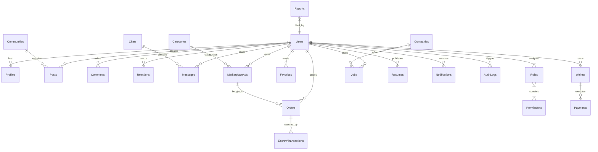

# 1. ER-Диаграмма базы данных EQUHUB (PostgreSQL)

## 1.1 Mermaid ER-Диаграмма

```mermaid
erDiagram
    Users ||--o{ Profiles : "has"
    Users ||--o{ Posts : "creates"
    Users ||--o{ Comments : "writes"
    Users ||--o{ Reactions : "reacts"
    Users ||--o{ Messages : "sends"
    Users ||--o{ MarketplaceAds : "owns"
    Users ||--o{ Favorites : "saves"
    Users ||--o{ Orders : "places"
    Users ||--o{ Wallets : "owns"
    Users ||--o{ Jobs : "posts"
    Users ||--o{ Resumes : "publishes"
    Users ||--o{ Notifications : "receives"
    Users ||--o{ AuditLogs : "triggers"
    Users }|--|{ Roles : "assigned"

    Roles }|--|{ Permissions : "contains"

    Communities ||--o{ Posts : "contains"
    Categories ||--o{ MarketplaceAds : "categorizes"
    MarketplaceAds ||--o{ Orders : "bought_in"
    Orders ||--o{ EscrowTransactions : "secured_by"
    Wallets ||--o{ Payments : "executes"

    Companies ||--o{ Jobs : "offers"
    Chats ||--o{ Messages : "contains"
    Reports }|--|| Users : "filed_by"
```

---

## 1.2 Схемы таблиц базы данных

### 1. Users (Пользователи)
| Поле | Тип | Ограничения | Описание |
| :--- | :--- | :--- | :--- |
| `id` | UUID | PRIMARY KEY, DEFAULT gen_random_uuid() | Уникальный идентификатор |
| `email` | VARCHAR(255) | UNIQUE, NOT NULL | Электронная почта |
| `phone` | VARCHAR(20) | UNIQUE | Номер телефона |
| `password_hash` | VARCHAR(255) | NOT NULL | Хэш пароля (Argon2 / bcrypt) |
| `is_active` | BOOLEAN | DEFAULT true | Флаг активности аккаунта |
| `is_verified` | BOOLEAN | DEFAULT false | Статус верификации |
| `two_factor_enabled` | BOOLEAN | DEFAULT false | Двухфакторная аутентификация |
| `created_at` | TIMESTAMPTZ | DEFAULT NOW() | Дата регистрации |
| `updated_at` | TIMESTAMPTZ | DEFAULT NOW() | Дата последнего обновления |

### 2. Profiles (Профили)
| Поле | Тип | Ограничения | Описание |
| :--- | :--- | :--- | :--- |
| `id` | UUID | PRIMARY KEY, REFERENCES Users(id) | Идентификатор профиля |
| `first_name` | VARCHAR(100) | NOT NULL | Имя |
| `last_name` | VARCHAR(100) | NOT NULL | Фамилия |
| `avatar_url` | TEXT | | Ссылка на аватар в S3 |
| `cover_url` | TEXT | | Ссылка на обложку профиля |
| `bio` | TEXT | | Краткое описание / О себе |
| `city` | VARCHAR(100) | | Город проживания |
| `rating` | NUMERIC(3, 2) | DEFAULT 5.00 | Средний рейтинг пользователя |
| `interests` | TEXT[] | | Список интересов |

### 3. Posts (Публикации социальной сети)
| Поле | Тип | Ограничения | Описание |
| :--- | :--- | :--- | :--- |
| `id` | UUID | PRIMARY KEY | Идентификатор поста |
| `author_id` | UUID | REFERENCES Users(id) | Автор публикации |
| `community_id` | UUID | REFERENCES Communities(id) NULL | Сообщество (при наличии) |
| `content` | TEXT | NOT NULL | Текст публикации |
| `media_urls` | TEXT[] | | Список прикрепленных фото/видео |
| `hashtags` | VARCHAR(50)[] | | Хэштеги |
| `likes_count` | INTEGER | DEFAULT 0 | Количество лайков |
| `comments_count`| INTEGER | DEFAULT 0 | Количество комментариев |
| `created_at` | TIMESTAMPTZ | DEFAULT NOW() | Время публикации |

### 4. MarketplaceAds (Объявления Маркетплейса)
| Поле | Тип | Ограничения | Описание |
| :--- | :--- | :--- | :--- |
| `id` | UUID | PRIMARY KEY | Идентификатор объявления |
| `seller_id` | UUID | REFERENCES Users(id) | Продавец |
| `category_id` | UUID | REFERENCES Categories(id) | Категория |
| `title` | VARCHAR(255) | NOT NULL | Название |
| `description` | TEXT | NOT NULL | Описание товара / услуги |
| `price` | NUMERIC(12, 2) | NOT NULL | Цена в рублях |
| `city` | VARCHAR(100) | NOT NULL | Город |
| `status` | VARCHAR(20) | DEFAULT 'active' | Статус ('active', 'sold', 'archived') |
| `ai_score` | NUMERIC(3, 1) | | AI оценка соответствия |
| `images` | TEXT[] | | Ссылки на медиафалы |

### 5. Jobs & Resumes (Вакансии и Резюме)
| Поле | Тип | Ограничения | Описание |
| :--- | :--- | :--- | :--- |
| `id` | UUID | PRIMARY KEY | Идентификатор записи |
| `type` | VARCHAR(20) | NOT NULL | Тип ('vacancy', 'resume') |
| `author_id` | UUID | REFERENCES Users(id) | Автор (HR / Соискатель) |
| `company_id` | UUID | REFERENCES Companies(id) NULL | Компания |
| `title` | VARCHAR(255) | NOT NULL | Должность |
| `sector` | VARCHAR(50) | NOT NULL | Отрасль (IT, HR, Sales...) |
| `salary` | NUMERIC(12, 2) | NOT NULL | Зарплатное предложение / Ожидания |
| `requirements` | TEXT | | Требования / Ключевые навыки |

### 6. EscrowTransactions (Безопасные Сделки)
| Поле | Тип | Ограничения | Описание |
| :--- | :--- | :--- | :--- |
| `id` | UUID | PRIMARY KEY | Идентификатор сделки |
| `order_id` | UUID | REFERENCES Orders(id) | Заказ |
| `buyer_id` | UUID | REFERENCES Users(id) | Покупатель |
| `seller_id` | UUID | REFERENCES Users(id) | Продавец |
| `amount` | NUMERIC(12, 2) | NOT NULL | Заблокированная сумма |
| `status` | VARCHAR(20) | NOT NULL | 'created', 'funded', 'shipped', 'completed', 'disputed' |
| `step` | INTEGER | DEFAULT 1 | Текущий шаг сделки (1..4) |
