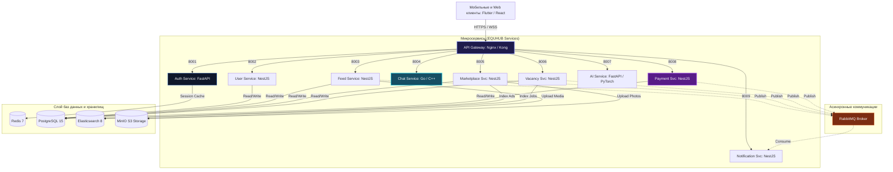
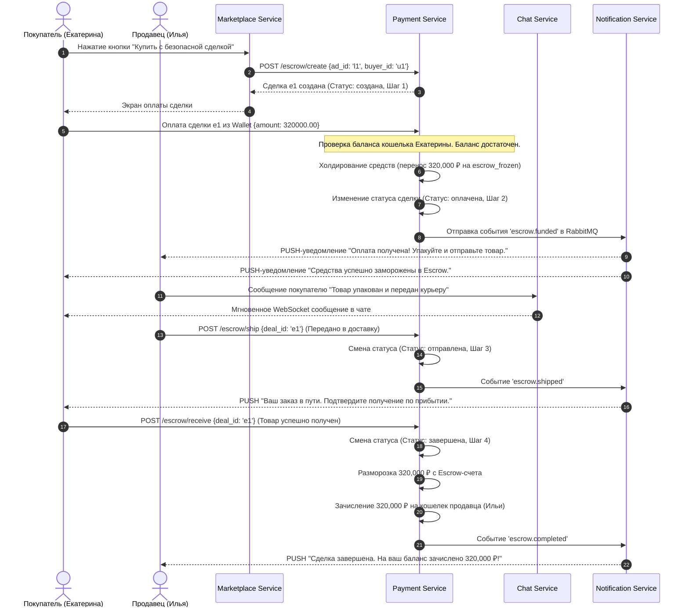
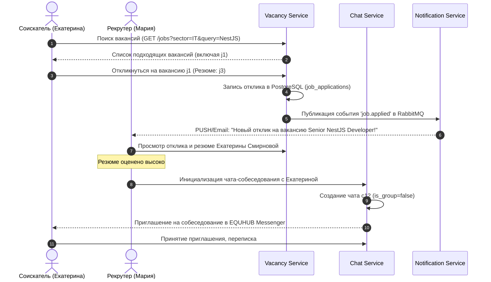

# 2. UML-диаграммы модулей и сервисов (EQUHUB)

Данный документ содержит UML-диаграммы компонентов и последовательности, описывающие внутреннее устройство и интеграцию микросервисов платформы **EQUHUB**.

---

## 2.1 Диаграмма компонентов (System Component Diagram)

Диаграмма иллюстрирует взаимодействие между Flutter-клиентами, API Gateway (Nginx), микросервисами бэкенда (FastAPI, NestJS, Go/C++), очередями сообщений RabbitMQ, кэш-слоем Redis, СУБД PostgreSQL, а также Elasticsearch и хранилищем файлов MinIO S3.

---

## 2.2 Диаграмма последовательности: Авторизация (JWT Auth Flow)

Процесс регистрации, авторизации, генерации токенов JWT (HS256) и последующего доступа к защищенному API через Gateway.

```mermaid
sequenceDiagram
    autonumber
    actor User as Пользователь (Клиент)
    participant GW as API Gateway (Nginx)
    participant Auth as Auth Service (FastAPI)
    participant Redis as Кэш (Redis)
    participant DB as СУБД (PostgreSQL)

    User->>GW: POST /api/v1/auth/login {email, password}
    GW->>Auth: Перенаправление запроса на порт 8001
    Auth->>DB: SELECT password_hash, 2fa_secret FROM users WHERE email = ?
    DB-->>Auth: Данные пользователя найдены
    Note over Auth: Валидация пароля (passlib/bcrypt)

    rect rgb(15, 23, 42)
        Note over Auth: Если 2FA включена, запрашивается TOTP-код
        Auth-->>User: 403 Required 2FA Code
        User->>GW: POST /api/v1/auth/login/2fa {code, session_id}
        GW->>Auth: Валидация кода TOTP
    end

    Auth->>Redis: Сохранение сессии сеанса в Redis
    Note over Auth: Генерация JWT Access Token (HS256) & Refresh Token
    Auth-->>User: 200 OK {access_token, refresh_token, profile_summary}

    Note over User, GW: Запрос к закрытому ресурсу (например, кошельку)
    User->>GW: GET /api/v1/payments/wallet (Headers: Authorization: Bearer <JWT>)
    Note over GW: Проверка подписи JWT на Gateway или вызов Auth Svc
    GW->>Auth: Верификация Access Token
    Auth-->>GW: Token Valid (User ID: u1, Roles: ['user'])
    GW->>User: 200 OK {wallet_balance: 450000.00}
```

---

## 2.3 Диаграмма последовательности: Безопасная сделка (Escrow / Secure Deal Flow)

Сквозной процесс покупки MacBook Pro на маркетплейсе с холдированием средств в Escrow и доставкой.

---

## 2.4 Диаграмма последовательности: Отклик на вакансию (Vacancy Recruitment Flow)

Как соискатель (Екатерина) находит и откликается на вакансию от EQUHUB Tech в новом MVP модуле Работа.

