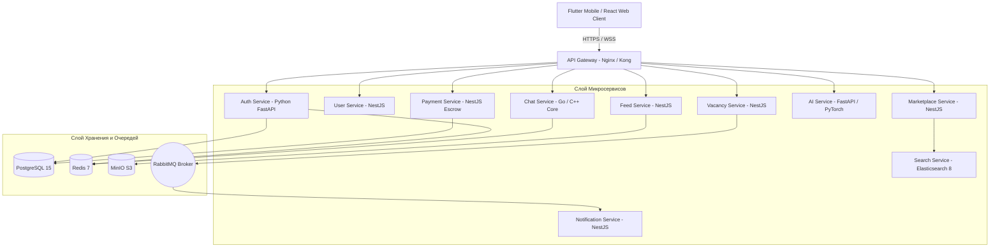
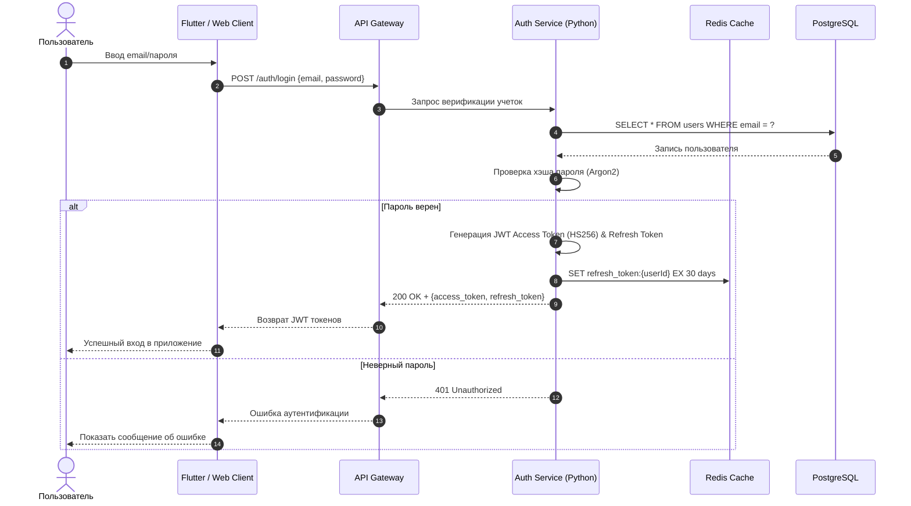
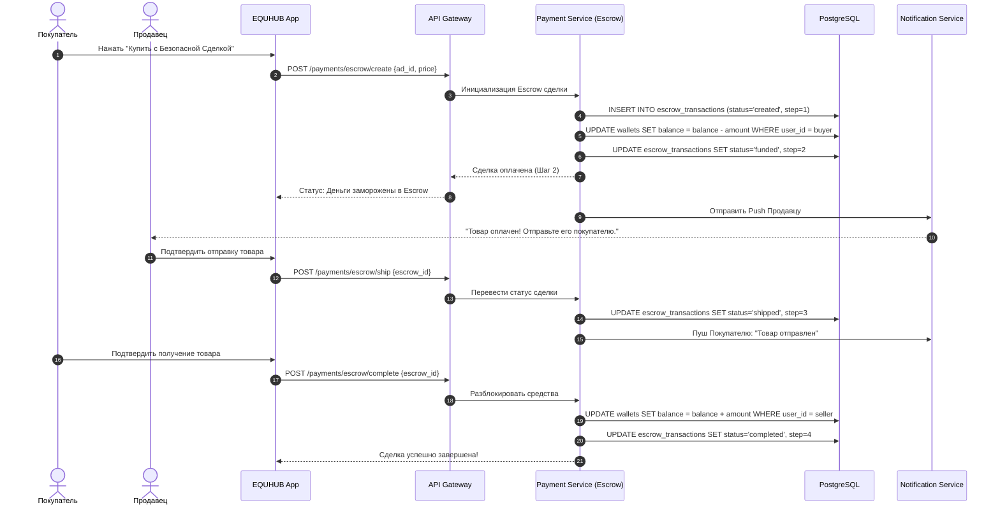

# 2. UML-Диаграммы модулей и сервисов EQUHUB

## 2.1 Диаграмма компонентов системы (Component Diagram)

```mermaid
graph TD
    ClientApps[Flutter Mobile / React Web Client]
    APIGateway[API Gateway - Nginx / Kong]

    subgraph Microservices ["Слой Микросервисов"]
        AuthSvc[Auth Service - Python FastAPI]
        UserSvc[User Service - NestJS]
        FeedSvc[Feed Service - NestJS]
        ChatSvc[Chat Service - Go / C++ Core]
        MarketSvc[Marketplace Service - NestJS]
        VacancySvc[Vacancy Service - NestJS]
        AISvc[AI Service - FastAPI / PyTorch]
        PaymentSvc[Payment Service - NestJS Escrow]
        NotifSvc[Notification Service - NestJS]
        SearchSvc[Search Service - Elasticsearch 8]
    end

    subgraph DataStore ["Слой Хранения и Очередей"]
        Postgres[(PostgreSQL 15)]
        RedisCache[(Redis 7)]
        MinIO[(MinIO S3)]
        RabbitMQ((RabbitMQ Broker))
    end

    ClientApps -->|HTTPS / WSS| APIGateway
    APIGateway --> AuthSvc
    APIGateway --> UserSvc
    APIGateway --> FeedSvc
    APIGateway --> ChatSvc
    APIGateway --> MarketSvc
    APIGateway --> VacancySvc
    APIGateway --> AISvc
    APIGateway --> PaymentSvc

    AuthSvc --> RedisCache
    AuthSvc --> Postgres
    ChatSvc --> RedisCache
    PaymentSvc --> Postgres
    MarketSvc --> SearchSvc
    VacancySvc --> RabbitMQ
    RabbitMQ --> NotifSvc
    FeedSvc --> MinIO
```

---

## 2.2 Sequence-диаграмма: Авторизация и получение JWT токенов

```mermaid
sequenceDiagram
    autonumber
    actor User as Пользователь
    participant App as Flutter / Web Client
    participant GW as API Gateway
    participant Auth as Auth Service (Python)
    participant Redis as Redis Cache
    participant DB as PostgreSQL

    User->>App: Ввод email/пароля
    App->>GW: POST /auth/login {email, password}
    GW->>Auth: Запрос верификации учеток
    Auth->>DB: SELECT * FROM users WHERE email = ?
    DB-->>Auth: Запись пользователя
    Auth->>Auth: Проверка хэша пароля (Argon2)

    alt Пароль верен
        Auth->>Auth: Генерация JWT Access Token (HS256) & Refresh Token
        Auth->>Redis: SET refresh_token:{userId} EX 30 days
        Auth-->>GW: 200 OK + {access_token, refresh_token}
        GW-->>App: Возврат JWT токенов
        App-->>User: Успешный вход в приложение
    else Неверный пароль
        Auth-->>GW: 401 Unauthorized
        GW-->>App: Ошибка аутентификации
        App-->>User: Показать сообщение об ошибке
    end
```

---

## 2.3 Sequence-диаграмма: Проведение Безопасной Сделки (Escrow)

```mermaid
sequenceDiagram
    autonumber
    actor Buyer as Покупатель
    actor Seller as Продавец
    participant App as EQUHUB App
    participant GW as API Gateway
    participant Pay as Payment Service (Escrow)
    participant DB as PostgreSQL
    participant Notif as Notification Service

    Buyer->>App: Нажать "Купить с Безопасной Сделкой"
    App->>GW: POST /payments/escrow/create {ad_id, price}
    GW->>Pay: Инициализация Escrow сделки
    Pay->>DB: INSERT INTO escrow_transactions (status='created', step=1)
    Pay->>DB: UPDATE wallets SET balance = balance - amount WHERE user_id = buyer
    Pay->>DB: UPDATE escrow_transactions SET status='funded', step=2
    Pay-->>GW: Сделка оплачена (Шаг 2)
    GW-->>App: Статус: Деньги заморожены в Escrow
    Pay->>Notif: Отправить Push Продавцу
    Notif-->>Seller: "Товар оплачен! Отправьте его покупателю."

    Seller->>App: Подтвердить отправку товара
    App->>GW: POST /payments/escrow/ship {escrow_id}
    GW->>Pay: Перевести статус сделки
    Pay->>DB: UPDATE escrow_transactions SET status='shipped', step=3
    Pay->>Notif: Пуш Покупателю: "Товар отправлен"

    Buyer->>App: Подтвердить получение товара
    App->>GW: POST /payments/escrow/complete {escrow_id}
    GW->>Pay: Разблокировать средства
    Pay->>DB: UPDATE wallets SET balance = balance + amount WHERE user_id = seller
    Pay->>DB: UPDATE escrow_transactions SET status='completed', step=4
    Pay-->>App: Сделка успешно завершена!
```
