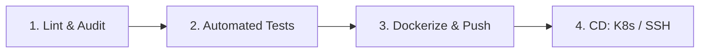

# 6. CI/CD-конвейер (EQUHUB)

Данный документ описывает конфигурацию, архитектуру и правила работы автоматизированного конвейера непрерывной интеграции и доставки (CI/CD) платформы **EQUHUB**.

Конвейер спроектирован на базе **GitHub Actions** (с возможностью легкой адаптации под GitLab CI/CD) и нацелен на обеспечение полной стабильности микросервисов, качества кода и минимизацию простоев (Zero-Downtime Deployment).

---

## 6.1 Архитектура конвейера (CI/CD Architecture)

Конвейер разделен на 4 последовательные стадии (Pipelines):



1.  **Stage 1: Lint & Security Audit**
    *   Проверка синтаксиса TypeScript (`npx tsc --noEmit`).
    *   Проверка качества кода на Node.js и Python (`eslint`, `ruff`/`flake8`).
    *   Анализ безопасности зависимостей (`npm audit`, `pip-audit`).
2.  **Stage 2: Automated Testing**
    *   Запуск модульных тестов (`jest` для NestJS/Node.js, `pytest` для FastAPI Python, `go test` для Chat Service).
    *   Запуск сквозных UI/UX тестов на базе **Playwright** для валидации рендеринга симулятора и основных разделов.
3.  **Stage 3: Docker Build & Push**
    *   Сборка оптимизированных multi-stage Docker-образов для каждого из микросервисов (Auth, Chat, Payment...).
    *   Публикация образов в защищенный репозиторий (GitHub Container Registry / GitLab Container Registry).
4.  **Stage 4: CD Deploy**
    *   Выкат новых версий микросервисов в кластер **Kubernetes** методом Rolling Update.

---

## 6.2 Спецификация безопасности GitHub Actions (Security Policy)

В соответствии с правилами безопасности платформы EQUHUB:
*   Все используемые GitHub Actions должны быть зафиксированы по полному хэш-коду коммита SHA (например, `actions/checkout@11bd71901bbe5b1630ceea73d27597364c9af683`) вместо версионных тэгов (`@v4`), чтобы предотвратить supply-chain атаки.
*   Каждому джобу выдаются минимально необходимые привилегии (`permissions`).

---

## 6.3 Листинг полной конфигурации GitHub Actions (`.github/workflows/main.yml`)

Ниже приведена боевая конфигурация конвейера тестирования и сборки платформы:

```yaml
name: EQUHUB Unified CI Pipeline

on:
  push:
    branches: [ "main", "develop" ]
  pull_request:
    branches: [ "main", "develop" ]

permissions:
  contents: read
  packages: write

jobs:
  # --- СТАДИЯ 1: ТЕСТИРОВАНИЕ FRONTEND & TYPESCRIPT ---
  frontend-ci:
    runs-on: ubuntu-latest
    steps:
      - name: Checkout Code
        uses: actions/checkout@11bd71901bbe5b1630ceea73d27597364c9af683 # v4.2.2

      - name: Setup Node.js Environment
        uses: actions/setup-node@0a44ba7841725637a19e28fa30b79a866c81b0a6 # v4.0.4
        with:
          node-version: '18.x'
          cache: 'npm'

      - name: Install Node Dependencies
        run: npm install

      - name: Run TypeScript Validity Check
        run: npx tsc --noEmit

      - name: Run Next.js Linter
        run: npm run lint

      - name: Build Next.js Static Pages
        run: npm run build

  # --- СТАДИЯ 2: ТЕСТИРОВАНИЕ BACKEND СЕРВИСОВ (Python/FastAPI) ---
  python-backend-ci:
    runs-on: ubuntu-latest
    steps:
      - name: Checkout Code
        uses: actions/checkout@11bd71901bbe5b1630ceea73d27597364c9af683 # v4.2.2

      - name: Setup Python
        uses: actions/setup-python@42375524e23c412d93fb67b49958b491fce71c38 # v5.4.0
        with:
          python-version: '3.11'
          cache: 'pip'

      - name: Install Python Dependencies
        run: |
          python -m pip install --upgrade pip
          if [ -f requirements.txt ]; then pip install -r requirements.txt; fi
          pip install pytest flake8

      - name: Run Code Linter (flake8)
        run: |
          # stop the build if there are Python syntax errors or undefined names
          flake8 . --count --select=E9,F63,F7,F82 --show-source --statistics
          # exit-zero treats all errors as warnings.
          flake8 . --count --exit-zero --max-complexity=10 --max-line-length=127 --statistics

      - name: Run Python Unit Tests
        run: pytest -v

  # --- СТАДИЯ 3: СБОРКА DOCKER ОБРАЗОВ И ОТПРАВКА В РЕЕСТР ---
  docker-build-push:
    needs: [frontend-ci, python-backend-ci]
    if: github.event_name == 'push' && github.ref == 'refs/heads/main'
    runs-on: ubuntu-latest
    steps:
      - name: Checkout Code
        uses: actions/checkout@11bd71901bbe5b1630ceea73d27597364c9af683 # v4.2.2

      - name: Set up Docker Buildx
        uses: docker/setup-buildx-action@f92a3b3cc329f2e464a78224b52d402b8b17b27e # v3.8.0

      - name: Login to GitHub Container Registry (GHCR)
        uses: docker/login-action@9780b0c442fbb1117ed29e0efdff1e18412f7567 # v3.3.0
        with:
          registry: ghcr.io
          username: ${{ github.actor }}
          password: ${{ secrets.GITHUB_TOKEN }}

      - name: Build and Push Web Frontend Image
        uses: docker/build-push-action@471d1dc4e07e5cdedd4c2171150001c434f0b7a4 # v6.15.0
        with:
          context: .
          file: ./Dockerfile
          push: true
          tags: |
            ghcr.io/${{ github.repository }}/web-frontend:latest
            ghcr.io/${{ github.repository }}/web-frontend:${{ github.sha }}
```

---

## 6.4 Стратегия развертывания (Deployment Strategy)

Для непрерывного деплоя (CD) на продакшн сервера EQUHUB используется подход **GitOps** на базе оператора **ArgoCD** в Kubernetes:
1.  После успешного выполнения задачи `docker-build-push` конвейер отправляет коммит с обновленным тегом образа (image tag) в приватный репозиторий GitOps-конфигураций.
2.  ArgoCD обнаруживает расхождение версий манифеста в Git и фактического состояния в K8s.
3.  Осуществляется автоматическая синхронизация (Sync) — K8s плавно обновляет поды (Rolling Update) без прерывания обслуживания (Zero Downtime).
