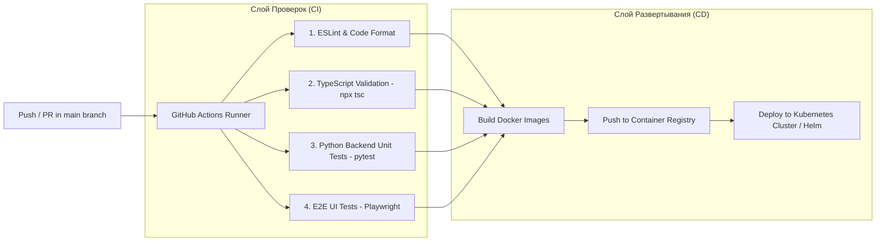

# 6. CI/CD-Конвейер и Автоматизация Сборки EQUHUB

## 6.1 Архитектура GitHub Actions CI/CD Pipeline


```mermaid
graph LR
    PushEvent[Push / PR in main branch] --> Trigger[GitHub Actions Runner]

    subgraph CI ["Слой Проверок (CI)"]
        Trigger --> LintStep[1. ESLint & Code Format]
        Trigger --> TypeCheckStep[2. TypeScript Validation - npx tsc]
        Trigger --> PytestStep[3. Python Backend Unit Tests - pytest]
        Trigger --> PlaywrightStep[4. E2E UI Tests - Playwright]
    end

    subgraph CD ["Слой Развертывания (CD)"]
        LintStep --> DockerBuild[Build Docker Images]
        TypeCheckStep --> DockerBuild
        PytestStep --> DockerBuild
        PlaywrightStep --> DockerBuild

        DockerBuild --> PushRegistry[Push to Container Registry]
        PushRegistry --> DeployProd[Deploy to Kubernetes Cluster / Helm]
    end
```

---

## 6.2 Конфигурационный файл `.github/workflows/ci.yml`

*Примечание: Все GitHub Actions зафиксированы по полному commit SHA для максимальной безопасности.*

```yaml
name: EQUHUB CI/CD Pipeline

on:
  push:
    branches: [ main, develop ]
  pull_request:
    branches: [ main ]

jobs:
  validate-and-test:
    runs-on: ubuntu-latest

    steps:
      - name: Checkout Code
        uses: actions/checkout@11bd71901bbe5b1630ceea73d27597364c9af683 # v4.2.2

      - name: Setup Node.js Environment
        uses: actions/setup-node@39370e3970a6d050c08000b2057761096d2b57e6 # v4.1.0
        with:
          node-version: 20
          cache: 'npm'

      - name: Install Frontend Dependencies
        run: npm ci

      - name: Verify TypeScript Types
        run: npx tsc --noEmit

      - name: Setup Python Environment
        uses: actions/setup-python@42375524e23c412d93fb67b49958b491fce71c38 # v5.4.0
        with:
          python-version: '3.12'

      - name: Install Python Dependencies & Run Tests
        run: |
          python -m pip install --upgrade pip
          pip install pytest playwright
          pytest

      - name: Run Playwright E2E Verification
        run: |
          npx playwright install --with-deps
          python -m pytest tests/verify_sound_gen.py
```
