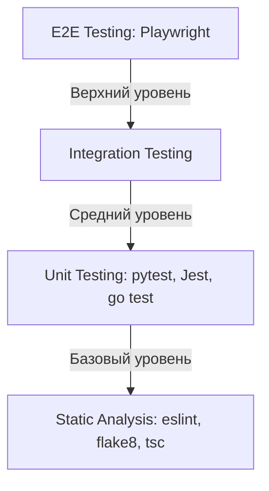

# 8. План тестирования (EQUHUB Testing Plan)

Данный документ описывает комплексную стратегию верификации, контроля качества и тестирования (Unit, Integration, End-to-End) Единой цифровой платформы **EQUHUB**.

Тестирование разделено на три уровня в соответствии с лучшими отраслевыми практиками.

---

## 8.1 Уровни тестирования (Testing Pyramid)



1.  **Unit (Модульное тестирование):**
    *   Быстрые тесты с изоляцией от баз данных с помощью моков (mocking).
    *   Инструменты: `pytest` (Python/FastAPI), `Jest` (NestJS/React), `testing` (Go).
2.  **Integration (Интеграционное тестирование):**
    *   Проверка корректности взаимодействия сервисов с PostgreSQL, Redis, Elasticsearch и RabbitMQ.
    *   Инструменты: `testcontainers` для автоматического поднятия СУБД в Docker во время тестов.
3.  **End-to-End (E2E / Сквозное тестирование):**
    *   Автоматизированные сценарии в реальном браузере с имитацией действий пользователя.
    *   Инструмент: **Playwright** для Python/JS.

---

## 8.2 Модульное тестирование (Unit Testing)

### 8.2.1 Бэкенд на Python (FastAPI Auth & AI)
Проверяется логика авторизации, генерации TOTP-кодов и ИИ-модерации контента.
Пример теста (`tests/test_dating_chatbot.py` или `tests/test_ai.py` на базе pytest):
```python
# test_ai_unit.py
from lib.ai import aiSuggestCategory, aiModerateListing

def test_ai_suggests_correct_category():
    assert aiSuggestCategory("Продам абсолютно новый MacBook Pro") == "Техника"
    assert aiSuggestCategory("Сдам в аренду просторную квартиру") == "Недвижимость"

def test_ai_moderator_detects_scam():
    result = aiModerateListing("Продам легкий скам и схему обмана")
    assert result["approved"] is False
    assert "обман" in result["reason"]
```

### 8.2.2 Бэкенд на NestJS & React (TypeScript)
Проверка рендеринга и состояний с помощью `Jest` и `@testing-library/react`.

---

## 8.3 Сквозное E2E тестирование (Playwright Plan)

Сквозное тестирование на Playwright охватывает критические пути пользователя (User Journeys), определенные в дорожной карте (Stage 1 MVP & Stage 2):
1.  **Авторизация:** Ввод корректного логина/пароля, прохождение мок-2FA, получение JWT и переход на главную.
2.  **Маркетплейс и Поиск:** Поиск товара по фильтрам, клик по карточке, проверка отображения AI-оценки.
3.  **Безопасная сделка (Escrow):** Запуск сделки, прохождение шагов (1: Создана -> 2: Оплачена -> 3: Отправлена -> 4: Завершена) и верификация автоматического обновления баланса кошелька в реальном времени.
4.  **Раздел "Работа" (MVP):** Поиск вакансий, переключение табов (Вакансии / Резюме) и отправка успешного отклика соискателя.

### 8.3.1 Сценарий Playwright на Python (`tests/verify_ui.py`)

Ниже представлен пример скрипта Playwright для E2E-верификации интерфейса личного кабинета, кошелька и раздела Работа:

```python
import sys
import time
from playwright.sync_api import sync_playwright

def verify_equhub_frontend():
    print("Запуск сквозного E2E-теста EQUHUB на Playwright...")
    with sync_playwright() as p:
        # Запуск браузера в фоновом (headless) режиме
        browser = p.chromium.launch(headless=True)
        page = browser.new_page()

        # Переход на локальный сервер Next.js
        url = "http://localhost:3000"
        try:
            page.goto(url, timeout=10000)
            print(f"Успешный переход на {url}")
        except Exception as e:
            print(f"Ошибка подключения к Next.js серверу: {e}")
            sys.exit(1)

        # 1. Проверяем заголовок бренда
        assert "EQUHUB" in page.title() or page.locator("text=EQUHUB").is_visible()
        print("✓ Заголовок бренда EQUHUB успешно верифицирован.")

        # 2. Клик на вкладку "Работа" в эмуляторе смартфона
        page.locator("text=Работа").click()
        time.sleep(1)
        assert page.locator("text=Senior NestJS Backend Developer").is_visible()
        print("✓ Раздел Работа и список вакансий успешно верифицированы.")

        # 3. Клик на кнопку "Откликнуться"
        page.locator("text=Откликнуться").first.click()
        time.sleep(1)
        assert page.locator("text=✓ Отправлено").is_visible() or page.locator("text=Отклик успешно отправлен!").is_visible()
        print("✓ Интерактивная отправка отклика на вакансию успешно проверена.")

        # 4. Проверяем кошелек и пополнение через СБП
        page.locator("text=Профиль").click()
        time.sleep(1)
        assert page.locator("text=КОШЕЛЁК EQUHUB").is_visible()

        # Сделать финальный скриншот для подтверждения верификации фронтенда
        screenshot_path = "public/screenshot_e2e.png"
        page.screenshot(path=screenshot_path)
        print(f"✓ Скриншот изменений успешно сохранен: {screenshot_path}")

        browser.close()
        print("E2E-тестирование успешно завершено! Все проверки пройдены.")

if __name__ == "__main__":
    verify_equhub_frontend()
```

---

## 8.4 Инструкции по запуску тестов

### 8.4.1 Запуск Unit-тестов Python
```bash
# Установка pytest (если отсутствует)
pip install pytest
# Запуск
pytest -v
```

### 8.4.2 Запуск E2E-тестов Playwright
```bash
# Установка Playwright зависимостей
pip install playwright
playwright install
# Запуск Next.js в фоне
npm run dev &
# Ожидание старта сервера Next.js
sleep 5
# Запуск сквозного сценария
python tests/verify_ui.py
```
