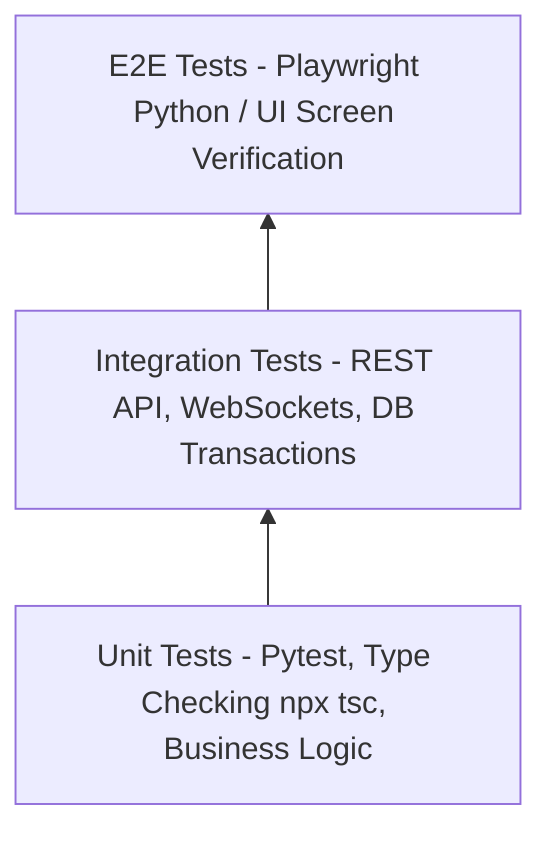

# 8. План тестирования EQUHUB (Unit, Integration, E2E)

## 8.1 Стратегия тестирования

Платформа EQUHUB использует многоуровневый подход к тестированию для обеспечения 100% надежности реалтайм и финансовых сервисов:


```mermaid
graph BT
    E2E[E2E Tests - Playwright Python / UI Screen Verification]
    Integration[Integration Tests - REST API, WebSockets, DB Transactions]
    Unit[Unit Tests - Pytest, Type Checking npx tsc, Business Logic]

    Unit --> Integration
    Integration --> E2E
```

---

## 8.2 Модульное тестирование (Unit Testing)

1. **Python / FastAPI Backend Services**:
   - Тестирование алгоритмов шифрования и верификации JWT HS256/RS256.
   - Проверка вспомогательных модулей (напр. `dating_chatbot.py` и AI модерации).
   - Команда запуска: `pytest`.

2. **Next.js / TypeScript Frontend**:
   - Полная статическая проверка типов с помощью компилятора TypeScript.
   - Проверка функций искусственного интеллекта (`lib/ai.ts`) и хелперов.
   - Команда запуска: `npx tsc --noEmit`.

---

## 8.3 Интеграционное тестирование (Integration Testing)

- **API Routes**: Тестирование эндпоинтов `/api/messages`, `/api/listings`, `/api/favorites`, `/api/auth`.
- **JWT Middleware**: Проверка отклонения запросов с поддельными идентификаторами отправителя (CWE-862 / CWE-347).
- **СУБД и Кэш**: Проверка транзакционности списания средств с баланса Кошелька при Escrow-сделке.

---

## 8.4 E2E Тестирование интерфейса (Playwright)

Пример скрипта сквозного тестирования пользовательского интерфейса на Python (`tests/verify_sound_gen.py`):

```python
from playwright.sync_api import sync_playwright

def test_verify_ui_rendering():
    with sync_playwright() as p:
        browser = p.chromium.launch(headless=True)
        page = browser.new_page()
        page.goto("http://localhost:3000")

        # Проверка заглавия страницы EQUHUB
        assert "EQUHUB" in page.title() or page.is_visible("text=EQUHUB")
        browser.close()
```
