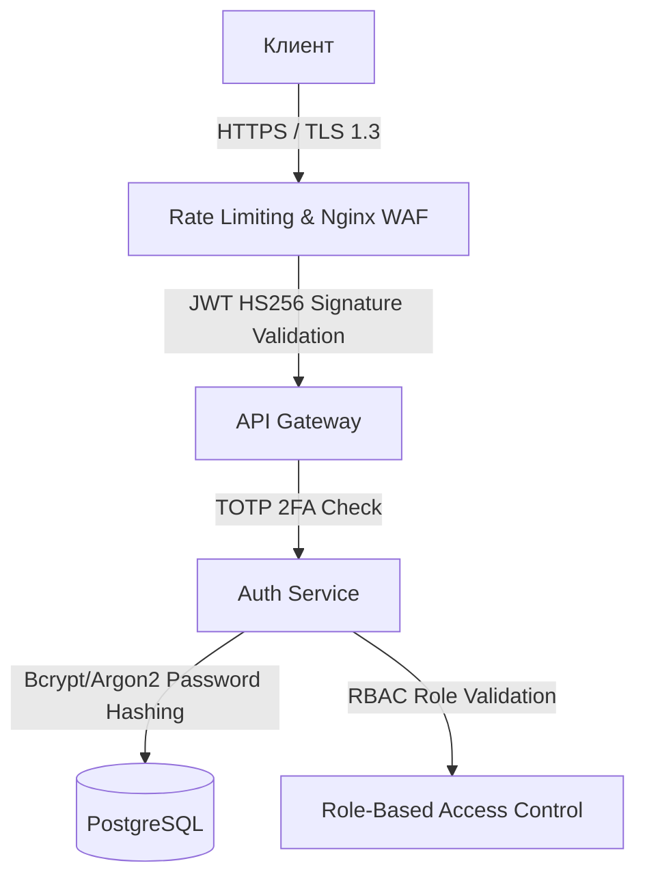

# 9. План информационной безопасности (EQUHUB Security Plan)

Данный документ представляет комплексную стратегию обеспечения информационной безопасности Единой цифровой платформы **EQUHUB**.

Безопасность системы выстроена по принципу эшелонированной защиты (Defense in Depth) и охватывает уровни авторизации, шифрования, сетевой инфраструктуры и аудита.

---

## 9.1 Архитектура безопасности (Security Layer Model)



---

## 9.2 Аутентификация и сессии (JWT & Token Management)

1.  **Алгоритм подписи:** Для выпуска токенов JWT используется стандарт **HS256** (HMAC с использованием SHA-256) с криптографически стойким секретным ключом длиной не менее 256 бит (32 символа).
2.  **Структура токенов:**
    *   **Access Token:** Срок жизни: 15 минут. Содержит минимально необходимые Claims: `sub` (User UUID), `email`, `roles`, `permissions`, `exp` (время истечения).
    *   **Refresh Token:** Срок жизни: 30 дней. Хранится в СУБД PostgreSQL в хэшированном виде и используется исключительно для получения новой пары токенов.
3.  **Безопасность хранения на клиенте:**
    *   **Мобильные приложения (Flutter):** Хранение JWT токенов осуществляется в системном безопасном хранилище (iOS Keychain / Android Secure Shared Preferences).
    *   **Web-клиент (Next.js):** Токены сохраняются в Cookie-файлах с флагами `HttpOnly`, `Secure` и `SameSite=Strict` для предотвращения XSS и CSRF атак.

---

## 9.3 Хранение паролей и двухфакторная аутентификация (2FA)

### 9.3.1 Хэширование учетных данных
Хранение паролей в открытом виде строго запрещено.
Для хэширования используется библиотека **passlib** (с алгоритмом `bcrypt` или `argon2id` со случайной солью (salt) и коэффициентом сложности (work factor) не менее 12).
```python
# Иллюстрация криптографической защиты пароля на FastAPI
from passlib.context import CryptContext

pwd_context = CryptContext(schemes=["bcrypt"], deprecated="auto")

def hash_password(password: str) -> str:
    return pwd_context.hash(password)

def verify_password(plain_password: str, hashed_password: str) -> bool:
    return pwd_context.verify(plain_password, hashed_password)
```

### 9.3.2 Двухфакторная аутентификация (2FA)
*   Реализована на базе стандарта **RFC 6238 (TOTP - Time-Based One-Time Password)**.
*   При включении 2FA пользователю генерируется уникальный секретный ключ Base32 и QR-код для сканирования в приложениях Google Authenticator / Yandex Key.
*   При каждом логине после проверки пароля Auth Service запрашивает 6-значный TOTP-код.

---

## 9.4 Защита API и Rate Limiting

Для исключения перегрузки микросервисов и автоматизированного сбора данных парсерами (Scraping):
1.  **Rate Limiting на Nginx Gateway:** Ограничение частоты запросов с одного IP-адреса до 100 r/s (запросов в секунду).
2.  **Защита от перебора паролей (Brute Force):** При 5 неудачных попытках входа в течение 10 минут аккаунт временно блокируется на 15 минут, а в журнал аудита вносится предупреждение.
3.  **CORS политики:** Заголовки Cross-Origin Resource Sharing на продакшне строго ограничены только доверенными поддоменами: `*.equhub.ru`.

---

## 9.5 Управление доступом (RBAC) и Аудит

Платформа использует ролевую модель разграничения прав доступа (Role-Based Access Control).

### 9.5.1 Роли и полномочия (Permissions)

| Роль | Полномочия | Описание |
| :--- | :--- | :--- |
| **Super Admin** | `*` (Полные права) | Полный доступ к инфраструктуре, базам данных, настройкам платежей и ролям. |
| **Moderator** | `ads:moderate`, `reports:resolve` | Проверка объявлений на маркетплейсе, блокировка скам-контента, разбор споров в безопасных сделках. |
| **Recruiter (Company)** | `jobs:create`, `jobs:delete` | Размещение вакансий, приглашение соискателей, просмотр откликов. |
| **User (Buyer/Seller)**| `ads:create`, `escrow:create`, `wallet:topup` | Базовый доступ к покупкам, продаже, чатам, кошельку и публикации резюме. |

### 9.5.2 Журналирование безопасности (Security Audit Logs)
Таблица `AuditLogs` фиксирует все ключевые события безопасности:
*   Успешная и неуспешная авторизация (IP, User-Agent).
*   Включение/выключение 2FA.
*   Переводы крупных сумм в Кошельке.
*   Создание споров/арбитражей по сделкам Escrow.
*   Действия администраторов в панели управления.

Логи аудита записываются в PostgreSQL в режиме "Append-Only" (запрещено удаление или редактирование записей) для обеспечения юридической значимости при расследовании инцидентов.
