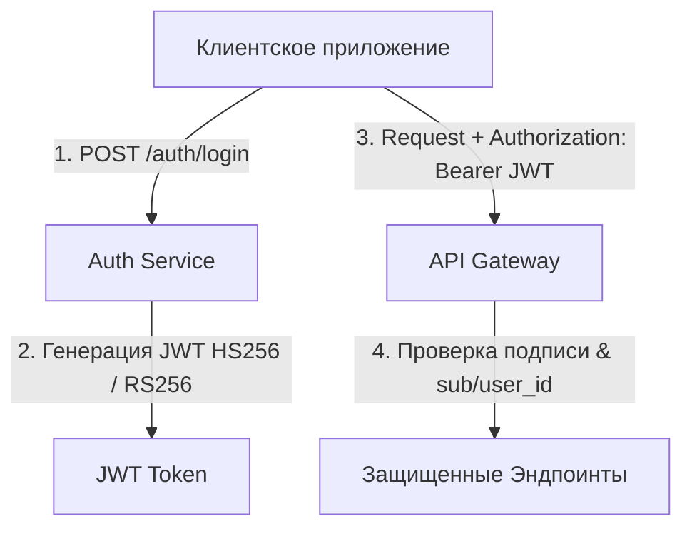

# 9. План Информационной Безопасности EQUHUB

## 9.1 Архитектура аутентификации и JWT

Система безопасности EQUHUB строит защиту по стандарту OWASP Top 10:

```mermaid
graph TD
    Client[Клиентское приложение] -->|1. POST /auth/login| AuthSvc[Auth Service]
    AuthSvc -->|2. Генерация JWT HS256 / RS256| JWT[JWT Token]
    Client -->|3. Request + Authorization: Bearer JWT| APIGateway[API Gateway]
    APIGateway -->|4. Проверка подписи & sub/user_id| ProtectedRoutes[Защищенные Эндпоинты]
```

### Принципы обработки токенов
1. **Подпись токена**: Использование HS256 (HMAC-SHA256) или RS256 асимметричных ключей.
2. **Защита от спуфинга (CWE-862 / CWE-347)**: Сервер категорически не доверяет полю `sender` из тела запроса. Идентификатор пользователя извлекается исключительно из валидированного JWT токена (`req.user.id`).
3. **Время жизни (TTL)**: Access Token — 15 минут; Refresh Token — 30 дней.

---

## 9.2 Ограничение частоты запросов (Rate Limiting)

Для защиты от DDoS-атак и перебора паролей на уровне Nginx API Gateway активированы следующие лимиты:
- `/auth/login`: Не более 5 запросов в минуту на один IP адрес.
- Публичные GET API: До 100 запросов в секунду на IP.

---

## 9.3 Гарантии безопасности Escrow (Безопасных Сделок)

1. **Двухфазная заморозка средств (2PC)**: Средства с баланса покупателя списываются и перечисляются на изолированный транзитный счёт Payment Service.
2. **Арбитраж**: При возникновении спора средства удерживаются на Escrow-счёте до принятия решения администратором.
