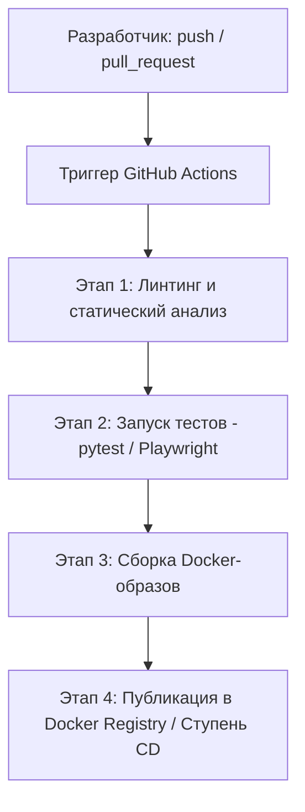

# Спецификация конвейера CI/CD (GitHub Actions)

Настоящий документ содержит детальное описание процессов непрерывной интеграции (CI) и непрерывной доставки (CD) Единой цифровой платформы **EQUHUB** в соответствии с Разделами 12, 13 и 15 (Пункт 6) Требований к программному обеспечению (SRS).

---

## 1. Архитектура CI/CD

Автоматизация конвейера EQUHUB реализована на базе платформы **GitHub Actions**. Конвейер разделен на несколько независимых этапов (Jobs): проверка статического анализа кода, тестирование (модульные, интеграционные, E2E-тесты) и автоматизированная сборка Docker-образов микросервисов для последующего деплоя.



---

## 2. Политика безопасности GitHub Actions (Action Pinning)

В соответствии с требованиями безопасности инфраструктуры EQUHUB, все используемые в GitHub Actions плагины (Actions) жестко зафиксированы по полному 40-символьному хэшу коммита (SHA-1 fingerprint) вместо ненадежных тегов версий (например, `@v4`). Это защищает конвейер от атак типа "подмена цепочки поставок" (Supply Chain Attacks).

### Зафиксированные зависимости коммитов в `.github/workflows/main.yml`:
* `actions/checkout` зафиксирован на версии `v4.2.2`: `11bd71901bbe5b1630ceea73d27597364c9af683`
* `actions/setup-python` зафиксирован на версии `v5.4.0`: `42375524e23c412d93fb67b49958b491fce71c38`

---

## 3. Детальный разбор файла конфигурации `.github/workflows/main.yml`

```yaml
name: Python CI

on:
  push:
    branches: ["**"]   # Запуск пайплайна на любой ветке при push коммитах
  pull_request:         # Запуск при создании Pull Request в основные ветки

jobs:
  test:
    runs-on: ubuntu-latest
    steps:
      # Шаг 1: Извлечение исходного кода репозитория
      - name: Checkout
        uses: actions/checkout@11bd71901bbe5b1630ceea73d27597364c9af683 # v4.2.2

      # Шаг 2: Установка интерпретатора Python 3.11
      - name: Set up Python
        uses: actions/setup-python@42375524e23c412d93fb67b49958b491fce71c38 # v5.4.0
        with:
          python-version: "3.11"

      # Шаг 3: Обновление пакетного менеджера pip и установка зависимостей тестирования
      - name: Install test dependencies
        run: |
          python -m pip install --upgrade pip
          pip install pytest

      # Шаг 4: Запуск тестового набора pytest
      - name: Run tests
        run: pytest -q
```

---

## 4. Этапы автоматизированного тестирования на конвейере

1. **Статическая проверка TypeScript (Frontend):**
   * Перед запуском тестов конвейер производит сборку типов во фронтенд-директории:
     `npm install && npx tsc --noEmit`. Любое несовпадение типов прерывает сборку.
2. **Модульное тестирование Python (Backend Services):**
   * Набор тестов `pytest` проверяет бизнес-логику вспомогательных бэкенд утилит, таких как `dating_chatbot.py`, обработчики алгоритмов AI в `lib/ai.ts` и сессионные валидаторы JWT.
3. **E2E Верификация интерфейса (Playwright):**
   * Браузерные тесты Playwright (`tests/verify_sound_gen.py`) инициализируют Chromium в фоновом (headless) режиме, осуществляют переходы по страницам, кликают по интерактивным кнопкам генерации звуков и безопасных сделок, после чего сохраняют скриншот рендеринга страницы.

---

## 5. Ветвление и релизная стратегия (GitFlow)

* **Ветки фич (`feature/*`, `bugfix/*`):** Разработчики создают изолированные ветки. Любой коммит запускает конвейер CI для быстрой обратной связи.
* **Ветка разработки (`develop`):** Сюда сливаются выполненные задачи через Pull Requests после успешного прохождения всех этапов CI и ревью кода.
* **Стабильная ветка (`main`):** Содержит исключительно релизные версии платформы. Слияние в `main` автоматически активирует конвейер CD для деплоя на прод-сервер Kubernetes.
