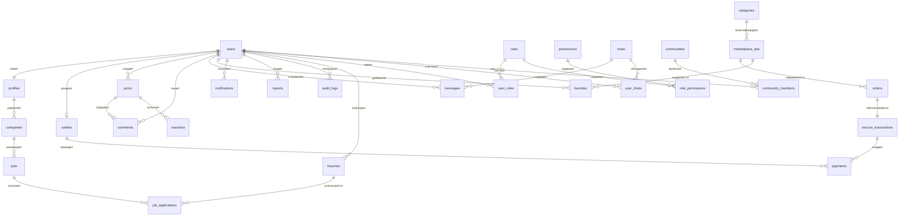

# Спецификация базы данных СУБД PostgreSQL (ER-диаграмма)

Настоящий документ содержит полное техническое описание схемы базы данных Единой цифровой платформы **EQUHUB** в соответствии с Разделом 4 и Разделом 15 (Пункт 1) Требований к программному обеспечению (SRS).

---

## 1. ER-диаграмма (Mermaid.js)

---

## 2. Описание таблиц и полей (Спецификация сущностей)

### 2.1 Таблица `users` (Пользователи)
Хранит учетные данные для авторизации (Раздел 2.1 SRS).

| Имя поля | Тип данных | Ограничения | Описание |
| :--- | :--- | :--- | :--- |
| `id` | `UUID` | `PRIMARY KEY`, `DEFAULT gen_random_uuid()` | Уникальный идентификатор пользователя |
| `email` | `VARCHAR(255)` | `UNIQUE`, `NOT NULL` | Электронная почта (логин) |
| `password_hash` | `VARCHAR(255)` | `NOT NULL` | Хэш пароля (используется passlib/bcrypt) |
| `phone_number` | `VARCHAR(20)` | `UNIQUE`, `NULL` | Номер телефона |
| `is_email_verified` | `BOOLEAN` | `DEFAULT FALSE` | Флаг подтверждения почты |
| `two_factor_secret` | `VARCHAR(128)` | `NULL` | Секретный ключ двухфакторной аутентификации |
| `is_two_factor_enabled` | `BOOLEAN` | `DEFAULT FALSE` | Включена ли 2FA |
| `status` | `VARCHAR(50)` | `DEFAULT 'active'` | Статус аккаунта (active, banned, suspended) |
| `created_at` | `TIMESTAMP WITH TIME ZONE` | `DEFAULT CURRENT_TIMESTAMP` | Дата и время регистрации |
| `updated_at` | `TIMESTAMP WITH TIME ZONE` | `DEFAULT CURRENT_TIMESTAMP` | Дата последнего обновления |

### 2.2 Таблица `profiles` (Профили пользователей)
Хранит персональную информацию профиля (Раздел 2.2 SRS).

| Имя поля | Тип данных | Ограничения | Описание |
| :--- | :--- | :--- | :--- |
| `id` | `UUID` | `PRIMARY KEY`, `FOREIGN KEY REFERENCES users(id)` | Ссылка на аккаунт пользователя |
| `first_name` | `VARCHAR(100)` | `NOT NULL` | Имя пользователя |
| `last_name` | `VARCHAR(100)` | `NOT NULL` | Фамилия пользователя |
| `avatar_url` | `VARCHAR(512)` | `NULL` | Ссылка на аватар в MinIO S3 |
| `cover_url` | `VARCHAR(512)` | `NULL` | Ссылка на обложку профиля |
| `bio` | `TEXT` | `NULL` | Краткая биография |
| `city` | `VARCHAR(100)` | `NULL` | Город проживания |
| `contacts` | `JSONB` | `NULL` | Дополнительные контакты (Telegram, VK, etc.) |
| `interests` | `VARCHAR(100)[]` | `DEFAULT '{}'` | Список интересов |
| `seller_rating` | `NUMERIC(3,2)` | `DEFAULT 5.00` | Рейтинг продавца на маркетплейсе (0.00 - 5.00) |
| `privacy_settings` | `JSONB` | `NOT NULL`, `DEFAULT '{}'` | Настройки приватности профиля |

### 2.3 Таблица `posts` (Публикации социальной сети)
Хранит посты в ленте активности (Раздел 2.3 SRS).

| Имя поля | Тип данных | Ограничения | Описание |
| :--- | :--- | :--- | :--- |
| `id` | `UUID` | `PRIMARY KEY`, `DEFAULT gen_random_uuid()` | Идентификатор публикации |
| `author_id` | `UUID` | `NOT NULL`, `FOREIGN KEY REFERENCES users(id)` | Автор публикации |
| `content` | `TEXT` | `NOT NULL` | Текстовое содержимое поста |
| `media_urls` | `VARCHAR(512)[]` | `DEFAULT '{}'` | Ссылки на прикрепленные медиафайлы в S3 |
| `hashtags` | `VARCHAR(100)[]` | `DEFAULT '{}'` | Массив хэштегов |
| `likes_count` | `INTEGER` | `DEFAULT 0` | Денормализованный счетчик лайков |
| `comments_count` | `INTEGER` | `DEFAULT 0` | Денормализованный счетчик комментариев |
| `created_at` | `TIMESTAMP WITH TIME ZONE` | `DEFAULT CURRENT_TIMESTAMP` | Время публикации |

### 2.4 Таблица `comments` (Комментарии к публикациям)
Хранит комментарии к постам.

| Имя поля | Тип данных | Ограничения | Описание |
| :--- | :--- | :--- | :--- |
| `id` | `UUID` | `PRIMARY KEY`, `DEFAULT gen_random_uuid()` | Идентификатор комментария |
| `post_id` | `UUID` | `NOT NULL`, `FOREIGN KEY REFERENCES posts(id) ON DELETE CASCADE` | Ссылка на пост |
| `author_id` | `UUID` | `NOT NULL`, `FOREIGN KEY REFERENCES users(id)` | Автор комментария |
| `content` | `TEXT` | `NOT NULL` | Текст комментария |
| `parent_id` | `UUID` | `NULL`, `FOREIGN KEY REFERENCES comments(id)` | Ссылка на родительский комментарий (для веток) |
| `created_at` | `TIMESTAMP WITH TIME ZONE` | `DEFAULT CURRENT_TIMESTAMP` | Время добавления |

### 2.5 Таблица `reactions` (Реакции на публикации)
Хранит лайки и эмодзи-реакции на публикации.

| Имя поля | Тип данных | Ограничения | Описание |
| :--- | :--- | :--- | :--- |
| `id` | `UUID` | `PRIMARY KEY`, `DEFAULT gen_random_uuid()` | Уникальный ID реакции |
| `post_id` | `UUID` | `NOT NULL`, `FOREIGN KEY REFERENCES posts(id) ON DELETE CASCADE` | Ссылка на публикацию |
| `user_id` | `UUID` | `NOT NULL`, `FOREIGN KEY REFERENCES users(id)` | Кто поставил реакцию |
| `reaction_type` | `VARCHAR(50)` | `DEFAULT 'like'` | Тип реакции (like, heart, laugh, etc.) |
| `created_at` | `TIMESTAMP WITH TIME ZONE` | `DEFAULT CURRENT_TIMESTAMP` | Время проставления |

*Уникальный индекс: `UNIQUE (post_id, user_id, reaction_type)`.*

### 2.6 Таблица `chats` (Комнаты чатов)
Хранит информацию о диалогах (Раздел 2.4 SRS).

| Имя поля | Тип данных | Ограничения | Описание |
| :--- | :--- | :--- | :--- |
| `id` | `UUID` | `PRIMARY KEY`, `DEFAULT gen_random_uuid()` | Идентификатор диалога |
| `type` | `VARCHAR(50)` | `NOT NULL`, `DEFAULT 'personal'` | Тип чата (personal, group, channel) |
| `title` | `VARCHAR(255)` | `NULL` | Название (только для групповых чатов/каналов) |
| `avatar_url` | `VARCHAR(512)` | `NULL` | Иконка группового чата |
| `created_at` | `TIMESTAMP WITH TIME ZONE` | `DEFAULT CURRENT_TIMESTAMP` | Время создания чата |

### 2.7 Таблица `messages` (Сообщения в чатах)
Хранит текстовые, медиа- и системные сообщения.

| Имя поля | Тип данных | Ограничения | Описание |
| :--- | :--- | :--- | :--- |
| `id` | `UUID` | `PRIMARY KEY`, `DEFAULT gen_random_uuid()` | Идентификатор сообщения |
| `chat_id` | `UUID` | `NOT NULL`, `FOREIGN KEY REFERENCES chats(id) ON DELETE CASCADE` | Чат, в котором отправлено сообщение |
| `sender_id` | `UUID` | `NOT NULL`, `FOREIGN KEY REFERENCES users(id)` | Отправитель |
| `text` | `TEXT` | `NULL` | Текстовое содержимое |
| `file_urls` | `VARCHAR(512)[]` | `DEFAULT '{}'` | Прикрепленные медиа/файлы в S3 |
| `is_read` | `BOOLEAN` | `DEFAULT FALSE` | Прочитано ли сообщение получателем |
| `is_disappearing`| `BOOLEAN` | `DEFAULT FALSE` | Исчезающее ли сообщение |
| `expires_at` | `TIMESTAMP WITH TIME ZONE` | `NULL` | Время удаления исчезающего сообщения |
| `created_at` | `TIMESTAMP WITH TIME ZONE` | `DEFAULT CURRENT_TIMESTAMP` | Время отправки |

### 2.8 Таблица `communities` (Сообщества/Группы)
Хранит сообщества по интересам.

| Имя поля | Тип данных | Ограничения | Описание |
| :--- | :--- | :--- | :--- |
| `id` | `UUID` | `PRIMARY KEY`, `DEFAULT gen_random_uuid()` | Идентификатор группы |
| `name` | `VARCHAR(255)` | `NOT NULL` | Название сообщества |
| `description` | `TEXT` | `NULL` | Описание сообщества |
| `avatar_url` | `VARCHAR(512)` | `NULL` | Логотип группы в S3 |
| `owner_id` | `UUID` | `NOT NULL`, `FOREIGN KEY REFERENCES users(id)` | Создатель/владелец группы |
| `members_count` | `INTEGER` | `DEFAULT 1` | Счетчик участников группы |
| `created_at` | `TIMESTAMP WITH TIME ZONE` | `DEFAULT CURRENT_TIMESTAMP` | Дата основания |

### 2.9 Таблица `marketplace_ads` (Объявления маркетплейса)
Сущность товаров и услуг на торговой площадке (Раздел 2.5 SRS).

| Имя поля | Тип данных | Ограничения | Описание |
| :--- | :--- | :--- | :--- |
| `id` | `UUID` | `PRIMARY KEY`, `DEFAULT gen_random_uuid()` | Идентификатор объявления |
| `seller_id` | `UUID` | `NOT NULL`, `FOREIGN KEY REFERENCES users(id)` | Продавец товара/услуги |
| `category_id` | `UUID` | `NOT NULL`, `FOREIGN KEY REFERENCES categories(id)` | Категория объявления |
| `title` | `VARCHAR(255)` | `NOT NULL` | Заголовок товара |
| `description` | `TEXT` | `NOT NULL` | Описание товара |
| `price` | `NUMERIC(15,2)` | `NOT NULL` | Цена в рублях |
| `city` | `VARCHAR(100)` | `NOT NULL` | Локация товара |
| `geo_location` | `POINT` | `NULL` | Координаты на карте для геопоиска |
| `image_urls` | `VARCHAR(512)[]` | `NOT NULL`, `DEFAULT '{}'` | Фотографии товара из MinIO S3 |
| `ai_score` | `INTEGER` | `DEFAULT 100` | Оценка качества/проверки AI-сервисом (0-100) |
| `status` | `VARCHAR(50)` | `DEFAULT 'active'` | Статус (active, sold, pending, archived) |
| `created_at` | `TIMESTAMP WITH TIME ZONE` | `DEFAULT CURRENT_TIMESTAMP` | Дата публикации |

### 2.10 Таблица `categories` (Категории товаров)
Классификатор для маркетплейса (Авто, Недвижимость, Техника, Услуги, Хобби).

| Имя поля | Тип данных | Ограничения | Описание |
| :--- | :--- | :--- | :--- |
| `id` | `UUID` | `PRIMARY KEY`, `DEFAULT gen_random_uuid()` | Уникальный ID категории |
| `name` | `VARCHAR(100)` | `UNIQUE`, `NOT NULL` | Название категории на русском |
| `slug` | `VARCHAR(100)` | `UNIQUE`, `NOT NULL` | URL-алиас категории (tech, auto, etc.) |

### 2.11 Таблица `favorites` (Избранные объявления)
Позволяет пользователям сохранять заинтересовавшие их объявления.

| Имя поля | Тип данных | Ограничения | Описание |
| :--- | :--- | :--- | :--- |
| `id` | `UUID` | `PRIMARY KEY`, `DEFAULT gen_random_uuid()` | ID записи |
| `user_id` | `UUID` | `NOT NULL`, `FOREIGN KEY REFERENCES users(id) ON DELETE CASCADE` | Пользователь |
| `ad_id` | `UUID` | `NOT NULL`, `FOREIGN KEY REFERENCES marketplace_ads(id) ON DELETE CASCADE` | Ссылка на товар |
| `created_at` | `TIMESTAMP WITH TIME ZONE` | `DEFAULT CURRENT_TIMESTAMP` | Время добавления |

*Уникальный индекс: `UNIQUE (user_id, ad_id)`.*

### 2.12 Таблица `orders` (Заказы товаров и услуг)
Проведение торговых сделок.

| Имя поля | Тип данных | Ограничения | Описание |
| :--- | :--- | :--- | :--- |
| `id` | `UUID` | `PRIMARY KEY`, `DEFAULT gen_random_uuid()` | Идентификатор заказа |
| `ad_id` | `UUID` | `NOT NULL`, `FOREIGN KEY REFERENCES marketplace_ads(id)` | Заказанный товар/услуга |
| `buyer_id` | `UUID` | `NOT NULL`, `FOREIGN KEY REFERENCES users(id)` | Покупатель |
| `seller_id` | `UUID` | `NOT NULL`, `FOREIGN KEY REFERENCES users(id)` | Продавец |
| `amount` | `NUMERIC(15,2)` | `NOT NULL` | Сумма к оплате |
| `status` | `VARCHAR(50)` | `DEFAULT 'created'` | Статус заказа (created, paid, shipped, completed, cancelled) |
| `created_at` | `TIMESTAMP WITH TIME ZONE` | `DEFAULT CURRENT_TIMESTAMP` | Дата создания |

### 2.13 Таблица `escrow_transactions` (Безопасные сделки - Escrow)
Замораживание средств покупателей для защиты сделок (Раздел 2.9 SRS).

| Имя поля | Тип данных | Ограничения | Описание |
| :--- | :--- | :--- | :--- |
| `id` | `UUID` | `PRIMARY KEY`, `DEFAULT gen_random_uuid()` | Идентификатор Escrow-транзакции |
| `order_id` | `UUID` | `UNIQUE`, `NOT NULL`, `FOREIGN KEY REFERENCES orders(id)` | Ссылка на обеспечиваемый заказ |
| `amount` | `NUMERIC(15,2)` | `NOT NULL` | Замороженная сумма |
| `status` | `VARCHAR(50)` | `DEFAULT 'held'` | Статус Escrow (held, released, refunded, disputed) |
| `held_at` | `TIMESTAMP WITH TIME ZONE` | `DEFAULT CURRENT_TIMESTAMP` | Время замораживания средств |
| `released_at`| `TIMESTAMP WITH TIME ZONE` | `NULL` | Время разморозки и выплаты продавцу |
| `refunded_at`| `TIMESTAMP WITH TIME ZONE` | `NULL` | Время возврата покупателю |

### 2.14 Таблица `wallets` (Внутренние кошельки пользователей)
Хранит финансовые балансы в системе.

| Имя поля | Тип данных | Ограничения | Описание |
| :--- | :--- | :--- | :--- |
| `id` | `UUID` | `PRIMARY KEY`, `DEFAULT gen_random_uuid()` | Уникальный ID кошелька |
| `user_id` | `UUID` | `UNIQUE`, `NOT NULL`, `FOREIGN KEY REFERENCES users(id)` | Владелец кошелька |
| `balance` | `NUMERIC(15,2)` | `DEFAULT 0.00`, `CHECK (balance >= 0.00)` | Доступный баланс в рублях |
| `updated_at` | `TIMESTAMP WITH TIME ZONE` | `DEFAULT CURRENT_TIMESTAMP` | Время последнего изменения баланса |

### 2.15 Таблица `payments` (Платежные транзакции)
Журнал всех финансовых операций кошелька.

| Имя поля | Тип данных | Ограничения | Описание |
| :--- | :--- | :--- | :--- |
| `id` | `UUID` | `PRIMARY KEY`, `DEFAULT gen_random_uuid()` | ID платежа |
| `wallet_id` | `UUID` | `NOT NULL`, `FOREIGN KEY REFERENCES wallets(id)` | Кошелек-участник |
| `type` | `VARCHAR(50)` | `NOT NULL` | Тип (deposit, withdraw, escrow_hold, escrow_release, escrow_refund) |
| `amount` | `NUMERIC(15,2)` | `NOT NULL` | Сумма транзакции |
| `description` | `VARCHAR(512)` | `NOT NULL` | Назначение платежа |
| `created_at` | `TIMESTAMP WITH TIME ZONE` | `DEFAULT CURRENT_TIMESTAMP` | Дата и время проведения |

### 2.16 Таблица `jobs` (Вакансии компаний)
Объявления о вакансиях в разделе "Работа" (Раздел 2.6 SRS).

| Имя поля | Тип данных | Ограничения | Описание |
| :--- | :--- | :--- | :--- |
| `id` | `UUID` | `PRIMARY KEY`, `DEFAULT gen_random_uuid()` | ID вакансии |
| `company_id` | `UUID` | `NOT NULL`, `FOREIGN KEY REFERENCES companies(id)` | Компания-работодатель |
| `title` | `VARCHAR(255)` | `NOT NULL` | Название должности |
| `description` | `TEXT` | `NOT NULL` | Текст вакансии, обязанности |
| `requirements`| `TEXT` | `NULL` | Квалификационные требования к кандидату |
| `salary` | `NUMERIC(12,2)` | `NULL` | Предлагаемая заработная плата |
| `city` | `VARCHAR(100)` | `NOT NULL` | Город вакансии |
| `sector` | `VARCHAR(50)` | `NOT NULL` | Сектор рынка труда (IT, HR, Sales, Design, etc.) |
| `status` | `VARCHAR(50)` | `DEFAULT 'open'` | Статус (open, closed, draft) |
| `created_at` | `TIMESTAMP WITH TIME ZONE` | `DEFAULT CURRENT_TIMESTAMP` | Дата публикации |

### 2.17 Таблица `resumes` (Резюме соискателей)
Резюме пользователей.

| Имя поля | Тип данных | Ограничения | Описание |
| :--- | :--- | :--- | :--- |
| `id` | `UUID` | `PRIMARY KEY`, `DEFAULT gen_random_uuid()` | ID резюме |
| `user_id` | `UUID` | `NOT NULL`, `FOREIGN KEY REFERENCES users(id)` | Владелец резюме |
| `title` | `VARCHAR(255)` | `NOT NULL` | Желаемая должность соискателя |
| `description` | `TEXT` | `NOT NULL` | Опыт работы, ключевые навыки |
| `requirements`| `TEXT` | `NULL` | Образование, курсы, сертификаты |
| `salary` | `NUMERIC(12,2)` | `NULL` | Ожидаемая заработная плата |
| `city` | `VARCHAR(100)` | `NOT NULL` | Город поиска |
| `sector` | `VARCHAR(50)` | `NOT NULL` | Профессиональная отрасль |
| `resume_file_url` | `VARCHAR(512)` | `NULL` | Ссылка на оригинальный PDF-файл в S3 |
| `created_at` | `TIMESTAMP WITH TIME ZONE` | `DEFAULT CURRENT_TIMESTAMP` | Дата публикации |

### 2.18 Таблица `companies` (Компании / Бизнес-кабинеты)
Профили юридических лиц/работодателей.

| Имя поля | Тип данных | Ограничения | Описание |
| :--- | :--- | :--- | :--- |
| `id` | `UUID` | `PRIMARY KEY`, `DEFAULT gen_random_uuid()` | ID компании |
| `owner_id` | `UUID` | `NOT NULL`, `FOREIGN KEY REFERENCES users(id)` | Администратор компании |
| `name` | `VARCHAR(255)` | `UNIQUE`, `NOT NULL` | Официальное наименование организации |
| `description` | `TEXT` | `NULL` | Описание деятельности, миссии |
| `logo_url` | `VARCHAR(512)` | `NULL` | Логотип компании в MinIO S3 |
| `website` | `VARCHAR(255)` | `NULL` | Официальный сайт |
| `industry` | `VARCHAR(100)` | `NULL` | Отрасль (IT, Consulting, Retail, etc.) |
| `created_at` | `TIMESTAMP WITH TIME ZONE` | `DEFAULT CURRENT_TIMESTAMP` | Дата регистрации компании |

### 2.19 Таблица `notifications` (Уведомления)
Хранит системные, пуш- и почтовые уведомления пользователей.

| Имя поля | Тип данных | Ограничения | Описание |
| :--- | :--- | :--- | :--- |
| `id` | `UUID` | `PRIMARY KEY`, `DEFAULT gen_random_uuid()` | ID уведомления |
| `user_id` | `UUID` | `NOT NULL`, `FOREIGN KEY REFERENCES users(id) ON DELETE CASCADE` | Получатель |
| `title` | `VARCHAR(255)` | `NOT NULL` | Заголовок уведомления |
| `body` | `TEXT` | `NOT NULL` | Текст сообщения |
| `type` | `VARCHAR(50)` | `DEFAULT 'system'` | Тип (system, chat, escrow, vacancy, promo) |
| `is_read` | `BOOLEAN` | `DEFAULT FALSE` | Прочитано ли пользователем |
| `created_at` | `TIMESTAMP WITH TIME ZONE` | `DEFAULT CURRENT_TIMESTAMP` | Время генерации |

### 2.20 Таблица `reports` (Жалобы/Обращения)
Журнал жалоб на объявления, посты или пользователей (Раздел 2.10 SRS).

| Имя поля | Тип данных | Ограничения | Описание |
| :--- | :--- | :--- | :--- |
| `id` | `UUID` | `PRIMARY KEY`, `DEFAULT gen_random_uuid()` | ID жалобы |
| `reporter_id` | `UUID` | `NOT NULL`, `FOREIGN KEY REFERENCES users(id)` | Инициатор жалобы |
| `target_type` | `VARCHAR(50)` | `NOT NULL` | На что жалоба (user, post, ad, comment) |
| `target_id` | `UUID` | `NOT NULL` | Идентификатор нарушителя/публикации |
| `reason` | `VARCHAR(255)` | `NOT NULL` | Причина жалобы (spam, fraud, insult, etc.) |
| `details` | `TEXT` | `NULL` | Подробные комментарии заявителя |
| `status` | `VARCHAR(50)` | `DEFAULT 'pending'` | Текущий статус (pending, investigating, resolved, rejected) |
| `created_at` | `TIMESTAMP WITH TIME ZONE` | `DEFAULT CURRENT_TIMESTAMP` | Дата подачи обращения |

### 2.21 Таблицы ролевой модели (`roles`, `permissions`, `user_roles`, `role_permissions`)
Обеспечивает гибкий контроль доступа (Раздел 2.10 SRS).

#### `roles` (Роли в системе)
* Поля: `id` (UUID), `name` (VARCHAR - Admin, Moderator, User, Recruiter, Merchant), `description` (TEXT).

#### `permissions` (Разрешения)
* Поля: `id` (UUID), `code` (VARCHAR - e.g., 'ban_user', 'moderate_ad', 'post_jobs', 'read_logs'), `description` (TEXT).

#### `user_roles` (Связь пользователей и ролей)
* Поля: `user_id` (UUID, FK), `role_id` (UUID, FK). Первичный ключ `(user_id, role_id)`.

#### `role_permissions` (Связь ролей и разрешений)
* Поля: `role_id` (UUID, FK), `permission_id` (UUID, FK). Первичный ключ `(role_id, permission_id)`.

### 2.22 Таблица `audit_logs` (Логи аудита)
Хранит журналы системной активности и безопасности.

| Имя поля | Тип данных | Ограничения | Описание |
| :--- | :--- | :--- | :--- |
| `id` | `UUID` | `PRIMARY KEY`, `DEFAULT gen_random_uuid()` | ID лога |
| `user_id` | `UUID` | `NULL`, `FOREIGN KEY REFERENCES users(id) ON DELETE SET NULL` | Совершивший действие пользователь |
| `action` | `VARCHAR(100)` | `NOT NULL` | Описание действия (e.g., 'user_login', 'delete_ad', 'withdraw') |
| `ip_address` | `INET` | `NULL` | IP-адрес совершения действия |
| `user_agent` | `VARCHAR(512)` | `NULL` | Браузер/Устройство пользователя |
| `payload` | `JSONB` | `NULL` | Дополнительные технические данные действия |
| `created_at` | `TIMESTAMP WITH TIME ZONE` | `DEFAULT CURRENT_TIMESTAMP` | Время события |

---

## 3. Ключевые базы данных СУБД & Кэш стратегии

Для соответствия высокой нагрузке на Единой цифровой платформе EQUHUB используется гибридный стек хранения:

1. **PostgreSQL 15** — Транзакционная база данных, обеспечивающая консистентность по принципу ACID для модулей `Payment Service`, `Auth Service`, `Vacancy Service` и сущностей безопасных сделок.
2. **Redis 7** — Быстрое кэширование в памяти (In-Memory Key-Value) для сессий, кэширования профилей, лимитов API (Rate Limiter), а также очередей сигнальных данных WebRTC.
3. **Elasticsearch 8** — Слой горизонтально масштабируемого полнотекстового поиска объявлений, вакансий, резюме и геокоординат.
4. **MinIO S3** — Распределенное хранилище файлов для документов резюме (.pdf, .docx), видеороликов, медиафайлов чатов и фотографий объявлений маркетплейса.
