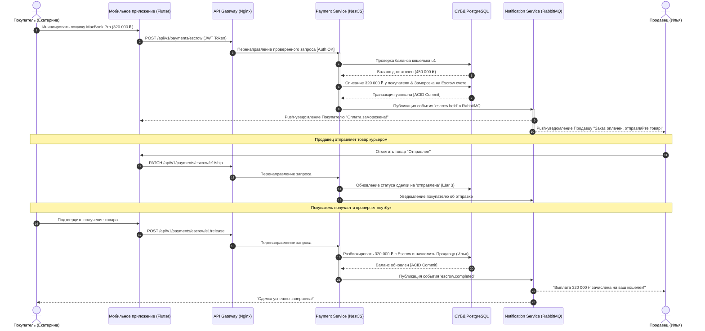
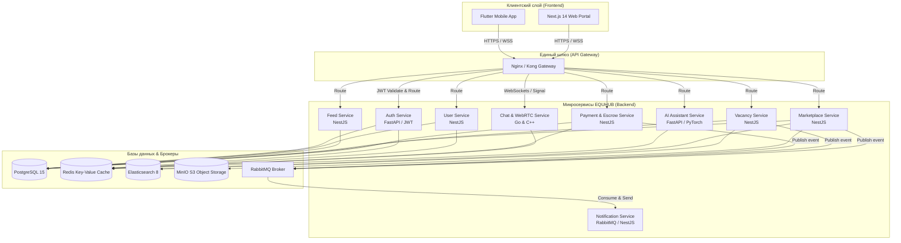

# UML-диаграммы модулей и микросервисов EQUHUB

Настоящий документ содержит спецификацию UML-диаграмм Единой цифровой платформы **EQUHUB** в соответствии с Разделами 3, 10 и 15 (Пункт 2) Требований к программному обеспечению (SRS). Динамика и структура взаимодействия описываются с помощью схем Mermaid.js.

---

## 1. Диаграмма прецедентов использования (Use Case Diagram)

Диаграмма показывает, какие роли пользователей (Соискатель/Покупатель, Работодатель/Продавец, Модератор/Администратор) взаимодействуют со следующими ключевыми модулями:

```mermaid
graph TD
    %% Акторы
    User[Пользователь / Покупатель / Соискатель]
    Merchant[Продавец / Работодатель]
    Admin[Администратор / Арбитр]

    %% Прецеденты Пользователя
    subgraph "Базовые модули"
        A1[Регистрация и Вход / JWT]
        A2[Просмотр новостной ленты]
        A3[Поиск товаров / Фильтры]
        A4[Отклик на вакансию / Создание резюме]
        A5[Общение в мессенджере]
    end

    %% Прецеденты Продавца / Работодателя
    subgraph "Бизнес-инструменты"
        B1[Создание объявления на маркетплейсе]
        B2[Размещение вакансии компании]
        B3[Проведение безопасной сделки / Escrow]
        B4[Запуск WebRTC видеовызова]
    end

    %% Прецеденты Администратора
    subgraph "Администрирование"
        C1[Модерация контента / AI фильтры]
        C2[Разрешение споров / Арбитраж Escrow]
        C3[Блокировка пользователей]
    end

    User --> A1
    User --> A2
    User --> A3
    User --> A4
    User --> A5

    Merchant --> A1
    Merchant --> B1
    Merchant --> B2
    Merchant --> B3
    Merchant --> B4

    Admin --> C1
    Admin --> C2
    Admin --> C3
```

---

## 2. Диаграмма последовательности (Sequence Diagram): Безопасная сделка (Escrow)

Диаграмма иллюстрирует процесс проведения безопасной сделки по шагам (от списания средств с кошелька Покупателя до заморозки в Escrow-оркестраторе и последующего релиза средств Продавцу при успешной доставке):

---

## 3. Диаграмма компонентов (Component Diagram): Микросервисная архитектура

Диаграмма компонентов отражает декомпозицию системы на бэкенд-сервисы, их взаимодействие через API Gateway и брокеры сообщений:

